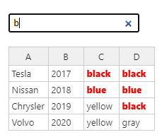

# Handsontable介绍

Handsontable是一个前端excel页面化插件 [Handsontable官网](https://handsontable.com/docs/javascript-data-grid/)

## vue3 npm引入

```bash
npm install handsontable @handsontable/vue3
```

## 基础组件

```js
<hot-table :data="data" :rowHeaders="true" :colHeaders="true"></hot-table>
```

# 配置项

## 基础配置

### data

> 表格内容,必填项

## 列相关配置

### colHeaders

> 配置列表头
>
> 可选类型:boolean|string[]|functon

```js
//为boolean时默认为[A,B,C...],与Excel类似
colHeaders: true,
```


```js
//为string[]时会显示数组中的数据
colHeaders: ['ID', 'Full name', 'Position','Country', 'City', 'Address']
```


```js
//为function时每一列表头会根据该方法生成内容
colHeaders(index) {
    return 'Col ' + (index + 1);
},
```


### nestedHeaders

> 配置多层级自定义表头
>
> 可选类型:array

```js
nestedHeaders: [
    ['A', { label: 'B', colspan: 8 }, 'C'],
    ['D', { label: 'E', colspan: 4 }, { label: 'F', colspan: 4 }, 'G'],
    ['H', { label: 'I', colspan: 2 }, { label: 'J', colspan: 2 }, { label: 'K', colspan: 2 }, { label: 'L', colspan: 2 }, 'M'],
    ['N', 'O', 'P', 'Q', 'R', 'S', 'T', 'U', 'V', 'W']
],
```


### hiddenColumns

> 隐藏列
>
> 可选类型:boolean|object

```js
//设置为boolean时所有列都生效
hiddenColumns: true,
```

```js
//如下配置为索引为3,5,9的列隐藏
hiddenColumns: {
    // specify columns hidden by default
    columns: [3, 5, 9]
}
```

### manualColumnMove

> 列数据支持拖拽移动
>
> 可选类型:boolean

```js
manualColumnMove: true,
```

如果你配置了colHeaders并是一个string[],那么你只能拖拽数组里面label所对应的列

### fixedColumnsStart

> 配置表格列冻结
>
> 可选类型:number

```js
//此配置是表格索引为1之前的列都冻结
fixedColumnsStart: 1,
```

### colWidths

> 设置列宽
>
> 可选类型:number|number[]|function

```js
//列宽统一设置为100px
colWidths: 100,
```

```js
//初始化前四列列宽为50px,100px,200px,400px,后面的列宽为默认值
colWidths: [50, 100, 200, 400],
```

```js
//列宽为方法返回值
colWidths(index) {
    return (index + 1) * 40;
},
```

### manualColumnResize

> 列宽是否支持用户手动调整
>
> 可选类型:boolean

```js
//配置后用户可鼠标拖拽跳转列宽
manualColumnResize: true,
```

### stretchH

> 列宽自适应方式
>
> stype:string

```js
//所有列都自动拉伸
stretchH: 'all', // 'none'为默认值
```


```js
//最后一列拉伸
stretchH: 'last',
```


### columnSummary

> 整列计算
>
> 可选类型:[]

```js
columnSummary: [
    {
      sourceColumn: 0,
      type: 'sum', //使用求和函数
      destinationRow: 3,
      destinationColumn: 0,
      forceNumeric: true
    },
    {
      sourceColumn: 1,
      type: 'min', //使用取最小值函数
      destinationRow: 3,
      destinationColumn: 1
    },
    {
      sourceColumn: 2,
      type: 'max', //使用取最大值函数
      destinationRow: 3,
      destinationColumn: 2
    },
    {
      sourceColumn: 3,
      type: 'count', //使用取当前列行数函数
      destinationRow: 3,
      destinationColumn: 3
    },
    {
      sourceColumn: 4,
      type: 'average', //使用求平均值函数
      destinationRow: 3,
      destinationColumn: 4
    }
  ]
```


### dropdownMenu

> 列控制器 <**font** id="dropdown_menu"> </**font**>
>
> 可选类型:boolean|string[]

```js
//开启默认的控制器
dropdownMenu: true,
```


```js
//根据关键词自定义配置,其中'---------'为分割
dropdownMenu: [
    'remove_col',
    '---------',
    'make_read_only',
    '---------',
    'alignment'
]
```


**可选关键字**

| 键名                                                         | 行为                                                         |
| :----------------------------------------------------------- | :----------------------------------------------------------- |
| [`row_above`](https://handsontable.com/docs/javascript-data-grid/api/context-menu/) | 上面插入一行                                                 |
| [`row_below`](https://handsontable.com/docs/javascript-data-grid/api/context-menu/) | 下面插入一行                                                 |
| [`col_left`](https://handsontable.com/docs/javascript-data-grid/api/context-menu/) | 插入到左边一列                                               |
| [`col_right`](https://handsontable.com/docs/javascript-data-grid/api/context-menu/) | 插入一列                                                     |
| [`---------`](https://handsontable.com/docs/javascript-data-grid/api/context-menu/) | 菜单项分隔符                                                 |
| [`remove_row`](https://handsontable.com/docs/javascript-data-grid/api/context-menu/) | 删除选中的行                                                 |
| [`clear_column`](https://handsontable.com/docs/javascript-data-grid/api/context-menu/) | 删除所选列的数据                                             |
| [`undo`](https://handsontable.com/docs/javascript-data-grid/api/context-menu/) | 复原上次的动作 ([`UndoRedo`](https://handsontable.com/docs/javascript-data-grid/api/undo-redo/)) |
| [`redo`](https://handsontable.com/docs/javascript-data-grid/api/context-menu/) | 重做最后的动作 ([`UndoRedo`](https://handsontable.com/docs/javascript-data-grid/api/undo-redo/)) |
| [`make_read_only`](https://handsontable.com/docs/javascript-data-grid/api/context-menu/) | 将选中的单元格只读                                           |
| [`alignment`](https://handsontable.com/docs/javascript-data-grid/api/context-menu/) | 文本对齐                                                     |
| [`cut`](https://handsontable.com/docs/javascript-data-grid/api/context-menu/) | 裁剪选中的内容到剪贴板([`CopyPaste`](https://handsontable.com/docs/javascript-data-grid/api/copy-paste/)) |
| [`copy`](https://handsontable.com/docs/javascript-data-grid/api/context-menu/) | 复制选中的内容到剪贴板([`CopyPaste`](https://handsontable.com/docs/javascript-data-grid/api/copy-paste/)) |
| [`copy_with_column_headers`](https://handsontable.com/docs/javascript-data-grid/api/context-menu/) | 带表头复制 ([`CopyPaste`](https://handsontable.com/docs/javascript-data-grid/api/copy-paste/)) |
| [`copy_with_column_group_headers`](https://handsontable.com/docs/javascript-data-grid/api/context-menu/) | 带多级表头复制 ([`CopyPaste`](https://handsontable.com/docs/javascript-data-grid/api/copy-paste/), [`NestedHeaders`](https://handsontable.com/docs/javascript-data-grid/api/nested-headers/)) |
| [`copy_column_headers_only`](https://handsontable.com/docs/javascript-data-grid/api/context-menu/) | 复制所选内容和他们离最近的表头 ([`CopyPaste`](https://handsontable.com/docs/javascript-data-grid/api/copy-paste/)) |
| [`freeze_column`](https://handsontable.com/docs/javascript-data-grid/api/context-menu/) | 冻结所选列 ([`ManualColumnFreeze`](https://handsontable.com/docs/javascript-data-grid/api/manual-column-freeze/)) |
| [`unfreeze_column`](https://handsontable.com/docs/javascript-data-grid/api/context-menu/) | 解冻所选列 ([`ManualColumnFreeze`](https://handsontable.com/docs/javascript-data-grid/api/manual-column-freeze/)) |
| [`borders`](https://handsontable.com/docs/javascript-data-grid/api/context-menu/) | 所选单元格加边框 ([`CustomBorders`](https://handsontable.com/docs/javascript-data-grid/api/custom-borders/)) |
| [`commentsAddEdit`](https://handsontable.com/docs/javascript-data-grid/api/context-menu/) | 添加或编辑注释 ([`Comments`](https://handsontable.com/docs/javascript-data-grid/api/comments/)) |
| [`commentsRemove`](https://handsontable.com/docs/javascript-data-grid/api/context-menu/) | 删除注释 ([`Comments`](https://handsontable.com/docs/javascript-data-grid/api/comments/)) |
| [`commentsReadOnly`](https://handsontable.com/docs/javascript-data-grid/api/context-menu/) | 设置备注为只读 ([`Comments`](https://handsontable.com/docs/javascript-data-grid/api/comments/)) |
| [`mergeCells`](https://handsontable.com/docs/javascript-data-grid/api/context-menu/) | 合并或拆分所选单元格 ([`MergeCells`](https://handsontable.com/docs/javascript-data-grid/api/merge-cells/)) |
| [`add_child`](https://handsontable.com/docs/javascript-data-grid/api/context-menu/) | 插入一个子行 ([`NestedRows`](https://handsontable.com/docs/javascript-data-grid/api/nested-rows/)) |
| [`detach_from_parent`](https://handsontable.com/docs/javascript-data-grid/api/context-menu/) | 从其上级分离所选行 ([`NestedRows`](https://handsontable.com/docs/javascript-data-grid/api/nested-rows/)) |
| [`hidden_columns_hide`](https://handsontable.com/docs/javascript-data-grid/api/context-menu/) | 隐藏所选列 ([`HiddenColumns`](https://handsontable.com/docs/javascript-data-grid/api/hidden-columns/)) |
| [`hidden_columns_show`](https://handsontable.com/docs/javascript-data-grid/api/context-menu/) | 显示隐藏列 ([`HiddenColumns`](https://handsontable.com/docs/javascript-data-grid/api/hidden-columns/)) |
| [`hidden_rows_hide`](https://handsontable.com/docs/javascript-data-grid/api/context-menu/) | 隐藏所选行 ([`HiddenRows`](https://handsontable.com/docs/javascript-data-grid/api/hidden-rows/)) |
| [`hidden_rows_show`](https://handsontable.com/docs/javascript-data-grid/api/context-menu/) | 显示隐藏行 ([`HiddenRows`](https://handsontable.com/docs/javascript-data-grid/api/hidden-rows/)) |
| [`filter_by_condition`](https://handsontable.com/docs/javascript-data-grid/api/context-menu/) | 添加一个筛选条件 ([`Filters`](https://handsontable.com/docs/javascript-data-grid/api/filters/)) |
| [`filter_by_condition2`](https://handsontable.com/docs/javascript-data-grid/api/context-menu/) | 添加第二个筛选条件 ([`Filters`](https://handsontable.com/docs/javascript-data-grid/api/filters/)) |
| [`filter_operators`](https://handsontable.com/docs/javascript-data-grid/api/context-menu/) | 选择一个筛选参数 ([`Filters`](https://handsontable.com/docs/javascript-data-grid/api/filters/)) |
| [`filter_by_value`](https://handsontable.com/docs/javascript-data-grid/api/context-menu/) | 添加一个筛选项 ([`Filters`](https://handsontable.com/docs/javascript-data-grid/api/filters/)) |
| [`filter_action_bar`](https://handsontable.com/docs/javascript-data-grid/api/context-menu/) | 应用配置的筛选器 ([`Filters`](https://handsontable.com/docs/javascript-data-grid/api/filters/)) |

## 行相关配置

### rowHeaders

> 配置列表头
>
> 可选类型:boolean|string[]|functon

```js
//为boolean时默认为[A,B,C...],与Excel类似
rowHeaders: true,
```

```js
//为string[]时会显示数组中的数据
rowHeaders: ['ID', 'Full name', 'Position','Country', 'City', 'Address']
```

```js
//为function时每一行表头会根据该方法生成内容
rowHeaders(index) {
    return 'Col ' + (index + 1);
},
```

### parent-child

> 该效果需要在data中设置
>
> 其格式如下

```js
[
    {
        category: '父级标签名',
        artist: null,
        title: null,
        label: null,
        //在此处配置子级数据
        __children:[
            {
            },
            {
            }
        ]
    }
]
```


### hiddenRows

> 隐藏行
>
> 可选类型:boolean|object

```js
//设置为boolean时所有行都生效
hiddenRows: true,
```

```js
//如下配置为索引为3,5,9的行隐藏
hiddenRows: {
    // specify columns hidden by default
    columns: [3, 5, 9]
}
```

### manualRowMove

> 行数据支持拖拽移动
>
> 可选类型:boolean

```js
manualRowMove: true,
```

### fixedRowsTop

> 配置表格行冻结
>
> 可选类型:number

```js
fixedRowsTop: 2, //表格索引为2之前的行都冻结
```

### fixedRowsBottom

> 配置表格行冻结
>
> 可选类型:number

```
fixedRowsBottom: 2, //表格索引为2之后的行都冻结
```

### rowHeights

> 配置表格行高
>
> 可选类型:number|number[]|function

```js
//行高统一设置为100px
rowHeights: 100,
```

```js
//初始化前四行行高为50px,100px,200px,400px,后面的行高为默认值
rowHeights: [50, 100, 200, 400],
```

```js
//行高为方法返回值
rowHeights(index) {
    return (index + 1) * 40;
},
```

### columnSorting

> 配置行排序
>
> 可选类型:boolean|object

```js
//所有列默认开启排序(此时还没有排序,需要用户点击表头手动排序)
columnSorting: true,
```

```js
columnSorting: {
    //是否开启排序
    sortEmptyCells: true,
    //排序初始化
    initialConfig: {
        column: 2, //按第几列属性排序
        sortOrder: 'asc' //设置为升序 'desc'为降序
    }
},
```

### trimRows

> 裁剪指定行数据
>
> 可选类型:number[]

```js
 //索引为1,2,5项不展示 
 data: [
    ['A1', 'B1', 'C1', 'D1'],
    ['A2', 'B2', 'C2', 'D2'],
    ['A3', 'B3', 'C3', 'D3'],
    ['A4', 'B4', 'C4', 'D4'],
    ['A5', 'B5', 'C5', 'D5'],
    ['A6', 'B6', 'C6', 'D6'],
    ['A7', 'B7', 'C7', 'D7'],
    ['A8', 'B8', 'C8', 'D8'],
    ['A9', 'B9', 'C9', 'D9'],
  ],
  trimRows: [1, 2, 5],
```


### beforeChange

> 最后一行输入内容可添加新的一行

```js
beforeChange(changes) {
    const instance = hot;
    const columns = instance.countCols();
    const rowColumnSeen = {};
    const rowsToFill = {};

    for (let i = 0; i < changes.length; i++) {
        // if oldVal is empty
        if (changes[i][2] === null && changes[i][3] !== null) {
            if (isEmptyRow(instance, changes[i][0])) {
                // add this row/col combination to the cache so it will not be overwritten by the template
                rowColumnSeen[changes[i][0] + '/' + changes[i][1]] = true;
                rowsToFill[changes[i][0]] = true;
            }
        }
    }

    for (var r in rowsToFill) {
        if (rowsToFill.hasOwnProperty(r)) {
            for (let c = 0; c < columns; c++) {
                // if it is not provided by user in this change set, take the value from the template
                if (!rowColumnSeen[r + '/' + c]) {
                    changes.push([r, c, null, templateValues[c]]);
                }
            }
        }
    }
}
```

## 单元格特性

### Clipboard

> 单元格内容与剪贴板交互

1.通过键盘调用剪贴板

- **Ctrl**/**Cmd** + **C** - 复制所选区域内容
- **Ctrl**/**Cmd** + **X** - 剪切所选区域内容

2.通过Context menu调用剪贴板

- Copy - 调用复制
- Cut - 调用剪切

3.通过api手动调用

```js
document.execCommand('copy')
document.execCommand('cut')
```

###  Selection

> 选中区域

1.设置选中模式

```js
selectionMode: 'multiple', // 'single', 'range' or 'multiple',
```

| 设置         | 描述                         |
| :----------- | :--------------------------- |
| `'single'`   | 允许用户一次只选择一个单元格 |
| `'range'`    | 允许用户选择一个范围的单元格 |
| `'multiple'` | 允许用户选择多个范围的单元格 |

2.获取用户选中内容

```js
//hot为excel实例
getButton.addEventListener('click', event => {
  //获取所选区域
  const selected = hot.getSelected() || [];
  const data = [];
  for (let i = 0; i < selected.length; i += 1) {
    const item = selected[i];
    //getData方法获取指定单元格内容
    data.push(hot.getData(...item));
  }
  output.innerText = JSON.stringify(data);
});
```

3.快捷键

| Windows                      | macOS                       | Action                                   | Excel | Sheets |
| :--------------------------- | :-------------------------- | :--------------------------------------- | :---: | :----: |
| **Ctrl** + **A**             | **Cmd** + **A**             | 选择所有单元格和标题                     |   ✓   |   ✓    |
| **Ctrl** + **Shift** + **↑** | **Cmd** + **Shift** + **↑** | 向上延长当前选择第一个单元格的行         |   ✓   |   ✓    |
| **Ctrl** + **Shift** + **↓** | **Cmd** + **Shift** + **↓** | 向下延长当前选择第一个单元格的行         |   ✓   |   ✓    |
| **Ctrl** + **Shift** + **←** | **Cmd** + **Shift** + **←** | 向左延长当前选择第一个单元格的列         |   ✓   |   ✓    |
| **Ctrl** + **Shift** + **→** | **Cmd** + **Shift** + **→** | 向右延长当前选择第一个单元格的列         |   ✓   |   ✓    |
| **Shift** + Arrow keys       | **Shift** + Arrow keys      | 根据对应方向单个延长                     |   ✓   |   ✓    |
| **Shift** + **Home**         | **Shift** + **Home**        | 扩展选择第一个当前行上单元格中           |   ✓   |   ✗    |
| **Shift** + **End**          | **Shift** + **End**         | 扩展选择当前行上单元格中                 |   ✗   |   ✗    |
| **Shift** + **Page Up**      | **Shift** + **Page Up**     | 同**Ctrl** + **Shift** + **↑**           |   ✓   |   ✓    |
| **Shift** + **Page Down**    | **Shift** + **Page Down**   | 同**Ctrl** + **Shift** + **↓**           |   ✓   |   ✓    |
| **Ctrl** + **Enter**         | **Cmd** + **Enter**         | 所选范围的单元格充满活动单元格的值       |   ✗   |   ✓    |
| **Delete**                   | **Delete**                  | 清除所选单元格                           |   ✓   |   ✓    |
| **Backspace**                | **Backspace**               | 清除高亮(所选单元格中最粗边框那个)单元格 |   ✓   |   ✓    |

Merge cells

> 合并单元格

1.用户操作快捷键

| Windows          | macOS            | Action                                       | Excel | Sheets |
| :--------------- | :--------------- | :------------------------------------------- | :---: | :----: |
| **Ctrl** + **M** | **Ctrl** + **M** | 合并所选单元格(单元格值会取左上角单元格的值) |   ✗   |   ✗    |

2.初始化中配置

```js
  mergeCells: [
    { row: 1, col: 1, rowspan: 3, colspan: 3 },
    { row: 3, col: 4, rowspan: 2, colspan: 2 },
    { row: 5, col: 6, rowspan: 3, colspan: 3 }
  ],
```


### Conditional formatting

> 设置表格样式

```css
//设置文字样式
function firstRowRenderer(instance, td, row, col, prop, value, cellProperties) {
  Handsontable.renderers.TextRenderer.apply(this, arguments);
  td.style.fontWeight = 'bold';
  td.style.color = 'green';
  td.style.background = '#CEC';
}
```


2.设置边框样式

### Text alignment

> 通过类目设置文字位置

```js
//设置整体文字样式
className: 'htCenter',
//单独设置文字样式
cell: [
    { row: 0, col: 0, className: 'htRight' },
    { row: 1, col: 1, className: 'htLeft htMiddle' },
    { row: 3, col: 4, className: 'htLeft htBottom' }
],
```

支持的类名

- Horizontal: `htLeft`, `htCenter`, `htRight`, `htJustify`,
- Vertical: `htTop`, `htMiddle`, `htBottom`.


### Disabled cells

> 单元格禁用模式(readOnly|editor)

| Read-only cell `readOnly: true`                              | Non-editable cell `editor: false`                            |
| :----------------------------------------------------------- | :----------------------------------------------------------- |
| 有一个附加的类名 (`htDimmed`)                                | 没有这个附加的类目                                           |
| 只读模式不支持复制单元格内容                                 | 支持                                                         |
| 不支持拖拽补全                                               | 支持拖拽补全                                                 |
| 不支持使用 [`populateFromArray()`](https://handsontable.com/docs/javascript-data-grid/api/core/#populatefromarray)api修改 | 支持使用 [`populateFromArray()`](https://handsontable.com/docs/javascript-data-grid/api/core/#populatefromarray)修改 |

```js
//初始化配置方式设置
columns: [
    //设置属性值为car的一列内容为只读
    {
        data: 'car',
        readOnly: true
    },
    {
        data: 'year'
    },
    {
        data: 'chassis'
    },
    {
        data: 'bumper'
    }
]
```

```js
//通过updateSettings方法设置
hot.updateSettings({
  cells(row, col) {
    const cellProperties = {};

    if (hot.getData()[row][col] === 'Nissan') {
      cellProperties.readOnly = true;
    }
    return cellProperties;
  }
});
```

### Comments

> 设置tooltip

```js
//全局设置
const hot = new Handsontable(container, {
  data: [
    ['A1', 'B1', 'C1'],
    ['A2', 'B2', 'C2'],
  ],
  comments: true
});
```

```js
//局部设置
cell: [
    { row: 1, col: 1, comment: { value: 'Some comment' } },
    { row: 2, col: 2, comment: { value: 'More comments' } }
],
```

效果展示


### Autofill values

> 拖拽新增行/列
>
> 可选类型:boolean|object

```js
fillHandle: true, // possible values: true, false, "horizontal", "vertical",
```

```js
//垂直方向开启拖拽新增
fillHandle: {
    direction: 'vertical',
    autoInsertRow: true
},
```

###  Formatting cells

>格式化单元格样式

1.设置单元格背景色

```css
//设置指定单元格背景色
td.custom-cell {
    color: #fff;
    background-color: #37bc6c;
}
//设置表头样式
.custom-table thead th:nth-child(even),
.custom-table tbody tr:nth-child(odd) th {
    background-color: #d7f1e1;
}
```

```javascript
  	//给表格添加类目
	className: 'custom-table',
    //给指定位置单元格添加类目
    cell: [
        {
            row: 0,
            col: 0,
            className: 'custom-cell',
        },
    ],
```


2.设置边框样式

```js
customBorders: [
    {
        range: {
            from: {
                row: 1,
                col: 1
            },
            to: {
                row: 3,
                col: 4
            }
        },
        top: {
            width: 2,
            color: '#5292F7'
        },
        bottom: {
            width: 2,
            color: 'red'
        },
        start: {
            width: 2,
            color: 'orange'
        },
        end: {
            width: 2,
            color: 'magenta'
        }
    },
    {
        row: 2,
        col: 2,
        start: {
            width: 2,
            color: 'red'
        },
        end: {
            width: 1,
            color: 'green'
        }
    }
]
```

3.自定义表格支持的所有配置项

- [`activeHeaderClassName`](https://handsontable.com/docs/javascript-data-grid/api/options/#activeheaderclassname)
- [`className`](https://handsontable.com/docs/javascript-data-grid/api/options/#classname)
- [`commentedCellClassName`](https://handsontable.com/docs/javascript-data-grid/api/options/#commentedcellclassname)
- [`currentColClassName`](https://handsontable.com/docs/javascript-data-grid/api/options/#currentcolclassname)
- [`currentHeaderClassName`](https://handsontable.com/docs/javascript-data-grid/api/options/#currentheaderclassname)
- [`currentRowClassName`](https://handsontable.com/docs/javascript-data-grid/api/options/#currentrowclassname)
- [`customBorders`](https://handsontable.com/docs/javascript-data-grid/api/options/#customborders)
- [`invalidCellClassName`](https://handsontable.com/docs/javascript-data-grid/api/options/#invalidcellclassname)
- [`noWordWrapClassName`](https://handsontable.com/docs/javascript-data-grid/api/options/#nowordwrapclassname)
- [`placeholder`](https://handsontable.com/docs/javascript-data-grid/api/options/#placeholder)
- [`placeholderCellClassName`](https://handsontable.com/docs/javascript-data-grid/api/options/#placeholdercellclassname)
- [`readOnlyCellClassName`](https://handsontable.com/docs/javascript-data-grid/api/options/#readonlycellclassname)
- [`tableClassName`](https://handsontable.com/docs/javascript-data-grid/api/options/#tableclassname)

## 单元格方法

### Cell functions

```js
const container = document.querySelector('#container');
const hot = new Handsontable(container, {
  columns: [{
    type: 'numeric' //renderer、editor等配置选项均可在此配置
  }]
});
//获取坐标[0,0]单元格
const cellProperties = hot.getCellMeta(0, 0);

cellProperties.renderer; // 获取单元格renderer属性
cellProperties.editor; // 获取单元格editor属性
cellProperties.validator; // 获取单元格合法性
cellProperties.type; // 获取单元格类型
```

单元格相关属性也可通过api获取

- [`getCellRenderer(row, col)`](https://handsontable.com/docs/javascript-data-grid/api/core/#getcellrenderer)
- [`getCellEditor(row, col)`](https://handsontable.com/docs/javascript-data-grid/api/core/#getcelleditor)
- [`getCellValidator(row, col)`](https://handsontable.com/docs/javascript-data-grid/api/core/#getcellvalidator)
- [`getCellType (row, col)`](https://handsontable.com/docs/javascript-data-grid/api/formulas/#getcelltype)

相关api

- 配置选项:
  - [`editor`](https://handsontable.com/docs/javascript-data-grid/api/options/#editor)
  - [`renderer`](https://handsontable.com/docs/javascript-data-grid/api/options/#renderer)
  - [`type`](https://handsontable.com/docs/javascript-data-grid/api/options/#type)
  - [`validator`](https://handsontable.com/docs/javascript-data-grid/api/options/#validator)
- 核心方法:
  - [`destroyEditor()`](https://handsontable.com/docs/javascript-data-grid/api/core/#destroyeditor)
  - [`getActiveEditor()`](https://handsontable.com/docs/javascript-data-grid/api/core/#getactiveeditor)
  - [`getCellEditor()`](https://handsontable.com/docs/javascript-data-grid/api/core/#getcelleditor)
  - [`getCellMeta()`](https://handsontable.com/docs/javascript-data-grid/api/core/#getcellmeta)
  - [`getCellMetaAtRow()`](https://handsontable.com/docs/javascript-data-grid/api/core/#getcellmetaatrow)
  - [`getCellsMeta()`](https://handsontable.com/docs/javascript-data-grid/api/core/#getcellsmeta)
  - [`getCellRenderer()`](https://handsontable.com/docs/javascript-data-grid/api/core/#getcellrenderer)
  - [`getCellValidator()`](https://handsontable.com/docs/javascript-data-grid/api/core/#getcellvalidator)
  - [`setCellMeta()`](https://handsontable.com/docs/javascript-data-grid/api/core/#setcellmeta)
  - [`setCellMetaObject()`](https://handsontable.com/docs/javascript-data-grid/api/core/#setcellmetaobject)
  - [`removeCellMeta()`](https://handsontable.com/docs/javascript-data-grid/api/core/#removecellmeta)
- Hooks:
  - [`afterBeginEditing`](https://handsontable.com/docs/javascript-data-grid/api/hooks/#afterbeginediting)
  - [`afterGetCellMeta`](https://handsontable.com/docs/javascript-data-grid/api/hooks/#aftergetcellmeta)
  - [`afterGetColumnHeaderRenderers`](https://handsontable.com/docs/javascript-data-grid/api/hooks/#aftergetcolumnheaderrenderers)
  - [`afterGetRowHeaderRenderers`](https://handsontable.com/docs/javascript-data-grid/api/hooks/#aftergetrowheaderrenderers)
  - [`afterValidate`](https://handsontable.com/docs/javascript-data-grid/api/hooks/#aftervalidate)
  - [`afterRenderer`](https://handsontable.com/docs/javascript-data-grid/api/hooks/#afterrenderer)
  - [`beforeGetCellMeta`](https://handsontable.com/docs/javascript-data-grid/api/hooks/#beforegetcellmeta)
  - [`beforeRenderer`](https://handsontable.com/docs/javascript-data-grid/api/hooks/#beforerenderer)
  - [`beforeValidate`](https://handsontable.com/docs/javascript-data-grid/api/hooks/#beforevalidate)

### Cell renderer

> 当你创建一个渲染器,可以为其取一个别名,后续可以通过别名引用这个渲染器的功能。Handsontable定义了默认10别名:<font id="cell_renderer"> </font>

- `autocomplete` for `Handsontable.renderers.AutocompleteRenderer`
- `base` for `Handsontable.renderers.BaseRenderer`
- `checkbox` for `Handsontable.renderers.CheckboxRenderer`
- `date` for `Handsontable.renderers.DateRenderer`
- `dropdown` for `Handsontable.renderers.DropdownRenderer`
- `html` for `Handsontable.renderers.HtmlRenderer`
- `numeric` for `Handsontable.renderers.NumericRenderer`
- `password` for `Handsontable.renderers.PasswordRenderer`
- `text` for `Handsontable.renderers.TextRenderer`
- `time` for `Handsontable.renderers.TimeRenderer`

> 除了使用默认别名外,还可以写函数创建自定义渲染器
>
> 此为还能为自定义渲染器创建别名

```js
//asterixDecoratorRenderer为方法创建一个别名为asterix
Handsontable.renderers.registerRenderer('asterix', asterixDecoratorRenderer);
```

如何如添加渲染器?

```js
const container = document.querySelector('#example4');
const hot = new Handsontable(container, {
  data,
  colWidths: [200, 200, 200, 80],
  colHeaders: ['Title', 'Description', 'Comments', 'Cover'],
  height: 'auto',
  columns: [
    //使用默认别名
    { data: 'title', renderer: 'html' },
    //使用上个代码块创建的自定义别名
    { data: 'description', renderer: 'asterix' },
    //使用自定义函数
    { data: 'comments', renderer: safeHtmlRenderer },
    //使用自定义函数
    { data: 'cover', renderer: coverRenderer }
  ],
  licenseKey: 'non-commercial-and-evaluation'
});
//自定义渲染器
function safeHtmlRenderer(instance, td, row, col, prop, value, cellProperties) {
  // WARNING: Be sure you only allow certain HTML tags to avoid XSS threats.
  // Sanitize the "value" before passing it to the innerHTML property.
  td.innerHTML = value;
}
//自定义渲染器
function coverRenderer(instance, td, row, col, prop, value, cellProperties) {
  const img = document.createElement('img');
  img.src = value;
  img.addEventListener('mousedown', event => {
    event.preventDefault();
  });
  td.innerText = '';
  td.appendChild(img);
  return td;
}
```

### Cell editor

> EditorManager是一个负责处理Handontable中所有可用编辑器的类。如果Handontable需要与编辑器交互，它将使用EditorManager对象。在第一次调用Handontable（）构造函数后，EditorManager对象在运行的init（）方法中实例化。EditorManager对象的引用在Handontable实例中是私有的，无法被访问。但是，有一些方法可以更改EditorManager的默认行为

[`EditorManager`](https://handsontable.com/docs/javascript-data-grid/api/base-editor/) 的四个主要作用

- 为激活单元格选择适当的编辑器
- 准备编辑器显示
- 打开编辑器
- 关闭编辑器

```js
//方法扩展
const CustomEditor = Handsontable.editors.BaseEditor.prototype.extend();

// This won't alter BaseEditor.prototype.beginEditing()
CustomEditor.prototype.beginEditing = function() {};
```

```js
//例子
//拦截set和get
class CalendarEditor extends TextEditor {
  constructor(hotInstance) {
    super(hotInstance);
  }

  getValue() {
    // returns currently selected date, for example "2023/09/15"
    return calendar.getDate();
  }

  setValue() {
    // highlights given date on calendar
    calendar.highlightDate(newValue);
  }
}
```

### Cell validator

> 使用预定义或自定义规则验证用户添加或更改的数据。验证有助于确保数据与预期格式相匹配。
>
> 单元格校验同样有提前预设的别名 <a href="#cell_renderer">参考Cell renderer</a>

- `autocomplete` for `Handsontable.validators.AutocompleteValidator`
- `date` for `Handsontable.validators.DateValidator`
- `dropdown` for `Handsontable.validators.DropdownValidator`
- `numeric` for `Handsontable.validators.NumericValidator`
- `time` for `Handsontable.validators.TimeValidator`

```js
//注册校验别名
Handsontable.validators.registerValidator('credit-card', creditCardValidator);
```

```js
//为指定列添加校验
const container = document.querySelector('#container')
const hot = new Handsontable(container, {
  columns: [{
    validator: 'credit-card'
  }]
});
```

## 单元格类型

### Cell type

> 使用Handontable的内置单元格类型，如自动完成、日期、时间等，在单元格渲染器、编辑器和验证器之间实现一致的UI
>
> 内置别名 <a href="#cell_renderer">参考Cell renderer</a>

- ["autocomplete"](https://handsontable.com/docs/javascript-data-grid/autocomplete-cell-type/) or `Handsontable.cellTypes.autocomplete`
- ["checkbox"](https://handsontable.com/docs/javascript-data-grid/checkbox-cell-type/) or `Handsontable.cellTypes.checkbox`
- ["date"](https://handsontable.com/docs/javascript-data-grid/date-cell-type/) or `Handsontable.cellTypes.date`
- ["dropdown"](https://handsontable.com/docs/javascript-data-grid/dropdown-cell-type/) or `Handsontable.cellTypes.dropdown`
- ["handsontable"](https://handsontable.com/docs/javascript-data-grid/handsontable-cell-type/) or `Handsontable.cellTypes.handsontable`
- ["numeric"](https://handsontable.com/docs/javascript-data-grid/numeric-cell-type/) or `Handsontable.cellTypes.numeric`
- ["password"](https://handsontable.com/docs/javascript-data-grid/password-cell-type/) or `Handsontable.cellTypes.password`
- ["select"](https://handsontable.com/docs/javascript-data-grid/select-cell-type/) or `Handsontable.cellTypes.select`
- ["time"](https://handsontable.com/docs/javascript-data-grid/time-cell-type/) or `Handsontable.cellTypes.time`
- "text" or `Handsontable.cellTypes.text`

```js
//注册单元格类型
Handsontable.cellTypes.registerCellType('my.custom', {
  editor: MyEditor,
  renderer: customRenderer,
  validator: customValidator,
  // You can add additional options to the cell type
  // based on Handsontable settings
  className: 'my-cell',
  allowInvalid: true,
  // Or you can add custom properties which
  // will be accessible in `cellProperties`
  myCustomCellState: 'complete',
});
```

```js
//使用别名
const hot = new Handsontable(container, {
  columns: [{
    type: 'my.custom'
  }]
});
```

### Numeric cell type

> numeric类型
>
> Handontable中的默认单元格类型为文本。文本单元格的数据被处理为字符串类型，该字符串类型对应于文本编辑器的内部＜textarea＞元素的值。但是，在许多情况下，您需要将单元格值视为数字类型。数字单元格类型允许您很好地格式化显示的数字并对其进行正确排序。

```js
//整个表格设置
type: 'numeric',
//某列单独设置
columns: [
  {
    type: 'numeric',
  },
]
//某个单元格单独设置
cell: [
  {
    row: 0,
    col: 0,
    type: 'numeric',
  }
],
```

numeric类型支持排序


###  Date cell type

> date类型
>
> 使用日期单元格类型可以显示、格式化和验证日期值。使用交互式弹出式编辑器选择日期。

```js
//设置日期类型配置如下
dateFormat: 'YYYY-MM-DD', //日期处理格式
correctFormat: true, //开启
defaultDate: '01/01/1900', //默认日期(非必填)
datePickerConfig: {
	// First day of the week (0: Sunday, 1: Monday, etc)
    firstDay: 0,
    showWeekNumber: true,
    numberOfMonths: 3,
    disableDayFn(date) {
    	// Disable Sunday and Saturday
        return date.getDay() === 0 || date.getDay() === 6;
    },
}
```


### Time cell type

> time类型
>
> 使用时间单元类型可以将值显示、格式化和验证为时间。时间单元类型使用Moment.js作为时间格式化程序。

```html
//该功能依赖项
<script src="https://cdn.jsdelivr.net/npm/moment@2.29.4/moment.min.js"></script>
```

```js
//配置方式
columns: [
    {
      type: 'time',
      //格式化规则
      timeFormat: 'h:mm:ss a',
      //如果启用correctFormat配置选项，则会自动格式化值以匹配所需的时间格式。
      correctFormat: true
    },
  ]
```


###  Checkbox cell type

> checkbox类型
>
> 这是默认的使用场景，其中列数据具有true或false值，并且我们只想显示复选框。

```js
columns: [
    {
        data: 'available',
        type: 'checkbox'
    }
],
```


###  Select cell type

> select类型
>
> 使用select单元格类型来收集具有HTML＜select＞元素的用户输入，该元素可创建多项目下拉列表。

```js
columns: [
    {},
    {
        editor: 'select',
        selectOptions: ['Kia', 'Nissan', 'Toyota', 'Honda']
    },
    {}
],
```


###  Dropdown cell type

> dropdown类型
>
> 通过使用下拉单元格类型，收集具有可搜索选项列表的用户输入。

```js
columns: [
    {},
    { type: 'numeric' },
    {
        type: 'dropdown',
        source: ['yellow', 'red', 'orange', 'green', 'blue', 'gray', 'black', 'white']
    },
    {
        type: 'dropdown',
        source: ['yellow', 'red', 'orange', 'green', 'blue', 'gray', 'black', 'white']
    }
],
```


### Autocomplete cell type

> autocomplete类型
>
> 通过使用自动完成单元格类型，收集具有选项列表的用户输入。

```js
  columns: [
    {
      type: 'autocomplete',
      source: ['BMW', 'Chrysler', 'Nissan', 'Suzuki', 'Toyota', 'Volvo'],
      strict: false
    },
    { type: 'numeric' },
    {
      type: 'autocomplete',
      source: colors,
      strict: false,
      visibleRows: 4
    },
    {
      type: 'autocomplete',
      source: colors,
      strict: false,
      trimDropdown: false
    }
  ]
```


###  Password cell type

> password类型
>
> 使用密码单元格类型，通过将输入的字符呈现为符号来屏蔽机密值。

```js
  columns: [
    { data: 'id' },
    { data: 'name.first' },
    { data: 'name.last' },
    { data: 'password', type: 'password' }
  ]
```


```js
//可配置加密图标长度
{ data: 'password', type: 'password', hashLength: 10 }
//可配置加密图标样式
{ data: 'password', type: 'password', hashSymbol: '&#9632;' }
```


###  Handsontable cell type

>handsontable类型
>
>使用可手持单元格类型，在弹出窗口中添加电子表格编辑器。

没看出来有啥用

## 单元格公式

### Formula calculation

> 使用强大的计算引擎对单元格的值执行计算，该引擎可处理380+个函数、自定义函数、命名表达式等。
>
> 在data中配置

```js
const data1 = [
  ['10.26', null, 'Sum', '=SUM(A:A)'],
  ['20.12', null, 'Average', '=AVERAGE(A:A)'],
  ['30.01', null, 'Median', '=MEDIAN(A:A)'],
  ['40.29', null, 'MAX', '=MAX(A:A)'],
  ['50.18', null, 'MIN', '=MIN(A1:A5)'],
];

const data2 = [
  ['Is A1 in Sheet1 > 10?', '=IF(Sheet1!A1>10,"TRUE","FALSE")'],
  ['Is A:A in Sheet > 150?', '=IF(SUM(Sheet1!A:A)>150,"TRUE","FALSE")'],
  ['How many blank cells are in the Sheet1?', '=COUNTBLANK(Sheet1!A1:D5)'],
  ['Generate a random number', '=RAND()'],
  ['Number of sheets in this workbook', '=SHEETS()'],
];
```

## 附件和菜单

###  Context menu

> 可选类型:boolean|string[]|object
>
> 可参考 <a href="#dropdown_menu">dropdownMenu</a>

```
//使用默认模板
contextMenu: true,
//使用别名自定义配置
contextMenu: ['row_above', 'row_below', 'remove_row'],
//自定义配置
contextMenu: {
    callback(key, selection, clickEvent) {
      // Common callback for all options
      console.log(key, selection, clickEvent);
    },
    items: {
      row_above: {
        disabled() { // `disabled` can be a boolean or a function
          // Disable option when first row was clicked
          return this.getSelectedLast()[0] === 0; // `this` === hot
        }
      },
      // A separator line can also be added like this:
      // 'sp1': { name: '---------' }
      // and the key has to be unique
      sp1: '---------',
      row_below: {
        name: 'Click to add row below' // Set custom text for predefined option
      },
      about: { // Own custom option
        name() { // `name` can be a string or a function
          return '<b>Custom option</b>'; // Name can contain HTML
        },
        hidden() { // `hidden` can be a boolean or a function
          // Hide the option when the first column was clicked
          return this.getSelectedLast()[1] == 0; // `this` === hot
        },
        callback(key, selection, clickEvent) { // Callback for specific option
          setTimeout(() => {
            alert('Hello world!'); // Fire alert after menu close (with timeout)
          }, 0);
        }
      },
      colors: { // Own custom option
        name: 'Colors...',
        submenu: {
          // Custom option with submenu of items
          items: [
            {
              // Key must be in the form 'parent_key:child_key'
              key: 'colors:red',
              name: 'Red',
              callback(key, selection, clickEvent) {
                setTimeout(() => {
                  alert('You clicked red!');
                }, 0);
              }
            },
            { key: 'colors:green', name: 'Green' },
            { key: 'colors:blue', name: 'Blue' }
          ]
        }
      },
      credits: { // Own custom property
        // Custom rendered element in the context menu
        renderer(hot, wrapper, row, col, prop, itemValue) {
          const elem = document.createElement('marquee');

          elem.style.cssText = 'background: lightgray;';
          elem.textContent = 'Brought to you by...';

          return elem;
        },
        disableSelection: true, // Prevent mouseoever from highlighting the item for selection
        isCommand: false // Prevent clicks from executing command and closing the menu
      }
    }
  }
```


**自定义配置**


> contextMenu有如下别名

| 键名                                                         | 行为                                                         |
| :----------------------------------------------------------- | :----------------------------------------------------------- |
| [`row_above`](https://handsontable.com/docs/javascript-data-grid/api/context-menu/) | 上面插入一行                                                 |
| [`row_below`](https://handsontable.com/docs/javascript-data-grid/api/context-menu/) | 下面插入一行                                                 |
| [`col_left`](https://handsontable.com/docs/javascript-data-grid/api/context-menu/) | 插入到左边一列                                               |
| [`col_right`](https://handsontable.com/docs/javascript-data-grid/api/context-menu/) | 插入一列                                                     |
| [`---------`](https://handsontable.com/docs/javascript-data-grid/api/context-menu/) | 菜单项分隔符                                                 |
| [`remove_row`](https://handsontable.com/docs/javascript-data-grid/api/context-menu/) | 删除选中的行                                                 |
| [`clear_column`](https://handsontable.com/docs/javascript-data-grid/api/context-menu/) | 删除所选列的数据                                             |
| [`undo`](https://handsontable.com/docs/javascript-data-grid/api/context-menu/) | 复原上次的动作 ([`UndoRedo`](https://handsontable.com/docs/javascript-data-grid/api/undo-redo/)) |
| [`redo`](https://handsontable.com/docs/javascript-data-grid/api/context-menu/) | 重做最后的动作 ([`UndoRedo`](https://handsontable.com/docs/javascript-data-grid/api/undo-redo/)) |
| [`make_read_only`](https://handsontable.com/docs/javascript-data-grid/api/context-menu/) | 将选中的单元格只读                                           |
| [`alignment`](https://handsontable.com/docs/javascript-data-grid/api/context-menu/) | 文本对齐                                                     |
| [`cut`](https://handsontable.com/docs/javascript-data-grid/api/context-menu/) | 裁剪选中的内容到剪贴板([`CopyPaste`](https://handsontable.com/docs/javascript-data-grid/api/copy-paste/)) |
| [`copy`](https://handsontable.com/docs/javascript-data-grid/api/context-menu/) | 复制选中的内容到剪贴板([`CopyPaste`](https://handsontable.com/docs/javascript-data-grid/api/copy-paste/)) |
| [`copy_with_column_headers`](https://handsontable.com/docs/javascript-data-grid/api/context-menu/) | 带表头复制 ([`CopyPaste`](https://handsontable.com/docs/javascript-data-grid/api/copy-paste/)) |
| [`copy_with_column_group_headers`](https://handsontable.com/docs/javascript-data-grid/api/context-menu/) | 带多级表头复制 ([`CopyPaste`](https://handsontable.com/docs/javascript-data-grid/api/copy-paste/), [`NestedHeaders`](https://handsontable.com/docs/javascript-data-grid/api/nested-headers/)) |
| [`copy_column_headers_only`](https://handsontable.com/docs/javascript-data-grid/api/context-menu/) | 复制所选内容和他们离最近的表头 ([`CopyPaste`](https://handsontable.com/docs/javascript-data-grid/api/copy-paste/)) |
| [`freeze_column`](https://handsontable.com/docs/javascript-data-grid/api/context-menu/) | 冻结所选列 ([`ManualColumnFreeze`](https://handsontable.com/docs/javascript-data-grid/api/manual-column-freeze/)) |
| [`unfreeze_column`](https://handsontable.com/docs/javascript-data-grid/api/context-menu/) | 解冻所选列 ([`ManualColumnFreeze`](https://handsontable.com/docs/javascript-data-grid/api/manual-column-freeze/)) |
| [`borders`](https://handsontable.com/docs/javascript-data-grid/api/context-menu/) | 所选单元格加边框 ([`CustomBorders`](https://handsontable.com/docs/javascript-data-grid/api/custom-borders/)) |
| [`commentsAddEdit`](https://handsontable.com/docs/javascript-data-grid/api/context-menu/) | 添加或编辑注释 ([`Comments`](https://handsontable.com/docs/javascript-data-grid/api/comments/)) |
| [`commentsRemove`](https://handsontable.com/docs/javascript-data-grid/api/context-menu/) | 删除注释 ([`Comments`](https://handsontable.com/docs/javascript-data-grid/api/comments/)) |
| [`commentsReadOnly`](https://handsontable.com/docs/javascript-data-grid/api/context-menu/) | 设置备注为只读 ([`Comments`](https://handsontable.com/docs/javascript-data-grid/api/comments/)) |
| [`mergeCells`](https://handsontable.com/docs/javascript-data-grid/api/context-menu/) | 合并或拆分所选单元格 ([`MergeCells`](https://handsontable.com/docs/javascript-data-grid/api/merge-cells/)) |
| [`add_child`](https://handsontable.com/docs/javascript-data-grid/api/context-menu/) | 插入一个子行 ([`NestedRows`](https://handsontable.com/docs/javascript-data-grid/api/nested-rows/)) |
| [`detach_from_parent`](https://handsontable.com/docs/javascript-data-grid/api/context-menu/) | 从其上级分离所选行 ([`NestedRows`](https://handsontable.com/docs/javascript-data-grid/api/nested-rows/)) |
| [`hidden_columns_hide`](https://handsontable.com/docs/javascript-data-grid/api/context-menu/) | 隐藏所选列 ([`HiddenColumns`](https://handsontable.com/docs/javascript-data-grid/api/hidden-columns/)) |
| [`hidden_columns_show`](https://handsontable.com/docs/javascript-data-grid/api/context-menu/) | 显示隐藏列 ([`HiddenColumns`](https://handsontable.com/docs/javascript-data-grid/api/hidden-columns/)) |
| [`hidden_rows_hide`](https://handsontable.com/docs/javascript-data-grid/api/context-menu/) | 隐藏所选行 ([`HiddenRows`](https://handsontable.com/docs/javascript-data-grid/api/hidden-rows/)) |
| [`hidden_rows_show`](https://handsontable.com/docs/javascript-data-grid/api/context-menu/) | 显示隐藏行 ([`HiddenRows`](https://handsontable.com/docs/javascript-data-grid/api/hidden-rows/)) |
| [`filter_by_condition`](https://handsontable.com/docs/javascript-data-grid/api/context-menu/) | 添加一个筛选条件 ([`Filters`](https://handsontable.com/docs/javascript-data-grid/api/filters/)) |
| [`filter_by_condition2`](https://handsontable.com/docs/javascript-data-grid/api/context-menu/) | 添加第二个筛选条件 ([`Filters`](https://handsontable.com/docs/javascript-data-grid/api/filters/)) |
| [`filter_operators`](https://handsontable.com/docs/javascript-data-grid/api/context-menu/) | 选择一个筛选参数 ([`Filters`](https://handsontable.com/docs/javascript-data-grid/api/filters/)) |
| [`filter_by_value`](https://handsontable.com/docs/javascript-data-grid/api/context-menu/) | 添加一个筛选项 ([`Filters`](https://handsontable.com/docs/javascript-data-grid/api/filters/)) |
| [`filter_action_bar`](https://handsontable.com/docs/javascript-data-grid/api/context-menu/) | 应用配置的筛选器 ([`Filters`](https://handsontable.com/docs/javascript-data-grid/api/filters/)) |

### Undo and redo

>使用撤消和重做功能恢复和恢复更改。

| Windows                      | macOS                       | Action         | Excel | Sheets |
| :--------------------------- | :-------------------------- | :------------- | :---: | :----: |
| **Ctrl** + **Z**             | **Cmd** + **Z**             | 复原上次的动作 |   ✓   |   ✓    |
| **Ctrl** + **Y**             | **Cmd** + **Y**             | 重做最后的动作 |   ✓   |   ✓    |
| **Ctrl** + **Shift** + **Z** | **Cmd** + **Shift** + **Z** | 重做最后的动作 |   ✓   |   ✓    |

### Keyboard shortcuts

> 使用内置键盘快捷键，类似于Google Sheets或Microsoft Excel在网格中导航。创建自己的快捷方式。

```js
//使用选定上下文的方法
const gridContext = hot.getShortcutManager().getContext('grid');

//在网格上下文中使用addShortcut（）方法
//简单例子
gridContext.addShortcut({
  group: 'group_ID',
  keys: [['enter']],
  callback: () => {},
});
//更完整例子
gridContext.addShortcut({
  group: 'customNumericEditor',
  position: 'before',
  relativeToGroup: 'editorManager.handlingEditor',
  runOnlyIf: () => { hot.getSelected() !== void 0 },
  keys: [['F2']],
  callback: () => {
    if (hot.getActiveEditor().cellProperties.type === 'numeric') {
      return false; // the `F2` shortcut won't work for `numeric` cells
    }

    // another action
  },
});
```

**每个键盘操作都在特定的上下文中注册：**

| Context  | 描述                                                         | Type     |
| :------- | :----------------------------------------------------------- | :------- |
| `grid`   | 当用户浏览数据网格（初始上下文）时激活                       | Built-in |
| `editor` | 当用户打开单元格编辑器时激活                                 | Built-in |
| `menu`   | 当用户打开单元格的上下文菜单时激活                           | Built-in |
| Custom   | 自定义 [custom context](https://handsontable.com/docs/javascript-data-grid/keyboard-shortcuts/#manage-keyboard-shortcut-contexts) | Custom   |

### Searching values

> 使用搜索插件的内置API方法(search)，并实现自己的搜索UI，在Handontable上搜索数据。

```js
//获取dom节点
const searchField = document.querySelector('#search_field');
//时间监听
searchField.addEventListener('keyup', function(event) {
  // get the `Search` plugin's instance
  const search = hot.getPlugin('search');
  // use the `Search` plugin's `query()` method
  const queryResult = search.query(event.target.value);
  console.log(queryResult);
  hot.render();
});
```

- 启用 [`Search`](https://handsontable.com/docs/javascript-data-grid/api/search/) 插件（通过将 [`Search`](https://handsontable.com/docs/javascript-data-grid/api/search/) 配置选项设置为true）
- 添加搜索输入侦听器
- 在搜索输入侦听器中，获取 [`Search`](https://handsontable.com/docs/javascript-data-grid/api/search/) 插件的实例
- 使用 [`Search`](https://handsontable.com/docs/javascript-data-grid/api/search/) 插件的 [`query()`](https://handsontable.com/docs/javascript-data-grid/api/search/#query) 方法


```js
//可通过给匹配的搜索项添加类名来控制样式
search: {
    // add your custom CSS class
    searchResultClass: 'my-custom-search-result-class'
},
//css部分
.my-custom-search-result-class{
  color: #ff0000;
  font-weight: 900;
}
```



### Icon pack

>使用我们的一组图标创建工具栏、菜单栏和上下文菜单，这些图标是专门为表格、电子表格和数据丰富的组件设计的。

```bash
npm install @handsontable/spreadsheet-icons
```

### Export to CSV

> 将网格的数据导出为CSV格式，作为可下载的文件、blob或字符串。使用Handontable的配置选项自定义导出。
>
> [`ExportFile`](https://handsontable.com/docs/javascript-data-grid/api/export-file/) 

```js
//导出为文件
button.addEventListener('click', () => {
  exportPlugin.downloadFile('csv', {
    bom: false,
    columnDelimiter: ',',
    columnHeaders: false,
    exportHiddenColumns: true,
    exportHiddenRows: true,
    fileExtension: 'csv',
    filename: 'Handsontable-CSV-file_[YYYY]-[MM]-[DD]',
    mimeType: 'text/csv',
    rowDelimiter: '\r\n',
    rowHeaders: true
  });
});
//导出为Blob
button.addEventListener('click', () => {
  const exportedBlob = exportPlugin.exportAsBlob('csv', {
    bom: false,
    columnDelimiter: ',',
    columnHeaders: false,
    exportHiddenColumns: true,
    exportHiddenRows: true,
    mimeType: 'text/csv',
    rowDelimiter: '\r\n',
    rowHeaders: true
  });
});
//导出为字符串
button.addEventListener('click', () => {
  const exportedString = exportPlugin.exportAsString('csv', {
    bom: false,
    columnDelimiter: ',',
    columnHeaders: false,
    exportHiddenColumns: true,
    exportHiddenRows: true,
    rowDelimiter: '\r\n',
    rowHeaders: true
  });
});
```

## 国际化

### Language

> 将Handontable的UI语言设置为内置翻译之一，或者使用我们的模板创建您自己的语言集。

**1.ES modules (ESM)**

```js
import Handsontable from 'handsontable/base';
import { registerLanguageDictionary, deDE } from 'handsontable/i18n';

registerLanguageDictionary(deDE);

const hot = new Handsontable(container, {
  language: deDE.languageCode,
});
```

**2.CommonJS (CJS)**

```js
const Handsontable = require('handsontable/base').default;
const { registerLanguageDictionary, deDE } = require('handsontable/i18n');

registerLanguageDictionary(deDE);

const hot = new Handsontable(container, {
  language: deDE.languageCode,
});
```

**3.Universal Module Definition (UMD)**

> 以这种方式包含的语言可以在加载文件后立即使用。每个文件都包含一个UMD加载程序，该加载程序在全局/外部上下文中查找“Handontable”。如果“Handontable”可用，则它会在适当的上下文中注册自己。

```html
<script type="text/javascript" src="dist/handsontable.full.js"></script>
<script type="text/javascript" src="dist/languages/de-DE.js"></script>
<script>
  const hot = new Handsontable(container, {
    language: 'zh-CN',
  });
</script>
```

### Locale

> 配置Handontable的区域设置，以正确处理与区域设置相关的数据和操作，如筛选、搜索或排序。

```js
//以表格为单位配置
const hot = new Handsontable(container, {
  // set the entire grid's locale to Polish
  locale: 'pl-PL',
});
//以列为单位配置
const hot = new Handsontable(container, {
  columns: [
    {
      // set the first column's locale to Polish
      locale: 'pl-PL',
    },
    {
      // set the second column's locale to German
      locale: 'de-DE',
    },
    {
      // set the third column's locale to Japanese
      locale: 'ja-JP',
    },
  ],
});
```

### Layout direction

> 设置从右到左语言的布局方向。自动继承HTML文件的dir属性，或手动设置布局方向。

```js
//方法1(全局注册)
import { registerLanguageDictionary, arAR } from 'handsontable/i18n';
registerLanguageDictionary(arAR);
//方法2(data项中配置)
layoutDirection: 'inherit', //可选参数 'inherit'|'rtl'|'ltr'
```

### IME support

> 使用输入法编辑器将击键转换为键盘上不可用的字符。此功能始终处于启用状态，并且可用于单元格编辑器。

## 工具和项目构建

### Packages

>使用预先构建的JavaScript和CSS UMD包，立即将Handontable添加到您的网络应用程序中。

```html
<!-- 完整引入 -->
<script src="dist/handsontable.full.js"></script>
<link href="dist/handsontable.full.css" rel="stylesheet
<!-- 压缩版本 -->
<script src="dist/handsontable.full.min.js"></script>
<link href="dist/handsontable.full.min.css" rel="stylesheet">
<!-- 按需引入 -->
<link href="https://cdn.jsdelivr.net/npm/pikaday@1.8.2/css/pikaday.min.css" rel="stylesheet">
<script src="https://cdn.jsdelivr.net/npm/moment@2.29.4/moment.min.js"></script>
<script src="https://cdn.jsdelivr.net/npm/pikaday@1.8.2/pikaday.min.js"></script>
<script src="https://cdn.jsdelivr.net/npm/numbro@2.1.2/dist/numbro.min.js"></script>
<script src="https://cdn.jsdelivr.net/npm/dompurify@2.4.0/dist/purify.js"></script>
```

### Modules

> 通过只导入所需的模块来减少JavaScript捆绑包的大小。基本模块是必需的，所有其他模块都是可选的。

支持的打包工具

- webpack
- Parcel
- Rollup
- Vite

### Custom plugins

> 通过编写自定义插件扩展Handontable的功能。使用BasePlugin快速入门。

**1.引入基础插件和注册插件函数**

```js
import { BasePlugin, registerPlugin } from 'handsontable/plugins';
```

**2.扩展基础插件**

```js
export class CustomPlugin extends BasePlugin {
  static get PLUGIN_KEY() {
    return 'customPlugin';
  }
  static get SETTING_KEYS() {
    return true;
  }
  constructor(hotInstance) {
    super(hotInstance);
    this.configuration = {
      enabled: false,
      msg: ''
    };
  }
  getUnifiedConfig() {
    const pluginSettings = this.hot.getSettings()[CustomPlugin.PLUGIN_KEY];

    if (pluginSettings === true) {
      return {
        enabled: true,
        msg: 'default msg boolean'
      };
    }
    if (Object.prototype.toString.call(pluginSettings) === '[object Object]') {
      return {
        enabled: true,
        msg: 'default msg obj',
        ...pluginSettings
      };
    }
    if (pluginSettings === false) {
      return {
        enabled: false,
        msg: ''
      };
    }

    throw new Error(
      `${CustomPlugin.PLUGIN_KEY} - incorrect plugins configuration.
      Passed:
        - type: ${typeof pluginSettings}
        - value: ${JSON.stringify(pluginSettings, null, ' ')}

      Expected:
        - boolean
        - object
      `
    );
  }
  isEnabled() {
    const pluginSettings = this.getUnifiedConfig();

    return pluginSettings.enabled;
  }
  enablePlugin() {
    this.configuration = this.getUnifiedConfig();
    this.addHook('afterChange', (changes, source) => this.onAfterChange(changes, source));
    super.enablePlugin();
  }
  disablePlugin() {
    this.configuration = null;
    super.disablePlugin();
  }
  updatePlugin() {
    const { enabled, msg } = this.getUnifiedConfig();
    if (enabled === false && this.enabled === true) {
      this.disablePlugin();

    } else if (enabled === true && this.enabled === false) {
      this.enablePlugin();
    }
    if (this.configuration !== null && msg && this.configuration.msg !== msg) {
      this.configuration.msg = msg;
    }

    super.updatePlugin();
  }
  externalMethodExample() {
    // Method definition.
  }
  onAfterChange(changes, source) {
    console.log(
      `${CustomPlugin.PLUGIN_KEY}.onAfterChange - ${this.configuration.msg}`,
      changes,
      source
    );
  }
  destroy() {
    super.destroy();
  }
}
```

**3.注册插件**

```js
//名字默认为函数名
registerPlugin(CustomPlugin);
//自定义名称
registerPlugin('CustomAlias', CustomPlugin);
```

**4.使用自定义插件**

```js
import Handsontable from 'handsontable';
import { CustomPlugin } from './customPlugin';

const hotInstance = new Handsontable(container, {
  // Pass `true` to enable the plugin with default options.
  [CustomPlugin.PLUGIN_KEY]: true,
  // You can also enable the plugin by passing an object with options.
  [CustomPlugin.PLUGIN_KEY]: {
    msg: 'user-defined message',
  },
  // You can also initialize the plugin without enabling it at the beginning.
  [CustomPlugin.PLUGIN_KEY]: false,
});
```

**5.获取对插件实例的引用**

```js
const pluginInstance = hotInstance.getPlugin(CustomPlugin.PLUGIN_KEY);
pluginInstance.externalMethodExample();
```

###  Custom builds

> Handontable的构建过程将位于代码存储库中的源文件转换为专用包。

`Handsontable`是一个单存储库，包含以下项目：

| 项目                    | 路径                | 描述                                                         |
| :---------------------- | :------------------ | :----------------------------------------------------------- |
| `handsontable`          | `/handsontable`     | Main Handsontable project                                    |
| `@handsontable/react`   | `/wrappers/react`   | [React wrapper](https://handsontable.com/docs/react-data-grid/) |
| `@handsontable/angular` | `/wrappers/angular` | [Angular wrapper](https://handsontable.com/docs/javascript-data-grid/angular-installation/) |
| `@handsontable/vue`     | `/wrappers/vue`     | [Vue 2 wrapper](https://handsontable.com/docs/javascript-data-grid/vue-installation/) |
| `@handsontable/vue3`    | `/wrappers/vue3`    | [Vue 3 wrapper](https://handsontable.com/docs/javascript-data-grid/vue3-installation/) |

构建过程将位于/handontable/src/目录中的源文件转换为以下输出文件：

- `/handsontable/dist/handsontable.js`
- `/handsontable/dist/handsontable.css`
- `/handsontable/dist/handsontable.full.js`
- `/handsontable/dist/handsontable.full.css`
- `/handsontable/dist/handsontable.full.min.js`
- `/handsontable/dist/handsontable.full.min.css`
- `/handsontable/dist/languages/*`

构建要求

- [Node.js (opens new window)](https://nodejs.org/)(version **16.19**+)
- [npm (opens new window)](https://www.npmjs.com/)(version **8.19**+)
- Node modules installed through `npm install` (e.g. [webpack](https://webpack.js.org/)and [Babel ](https://babeljs.io/))

每个Handontable项目都在自己的package.json文件中定义了自己的构建过程。除此之外，根目录还有自己的package.json文件：

| File                             | Holds tasks for building:                        |
| :------------------------------- | :----------------------------------------------- |
| `/package.json`                  | - All the packages at once - Individual packages |
| `/handsontable/package.json`     | The JavaScript package                           |
| `/wrappers/react/package.json`   | The React package                                |
| `/wrappers/angular/package.json` | The Angular package                              |
| `/wrappers/vue/package.json`     | The Vue 2 package                                |
| `/wrappers/vue3/package.json`    | The Vue 3 package                                |

### Testing

> 使用Handontable为Jasmine和Puppeter提供的现成命令运行一个或多个测试。

要从monorepo的根目录运行所有测试，请使用以下命令：

- `npm run test`

要运行单独的测试，请转到“/handstandable”目录，并使用以下命令：

- `npm test` - 运行所有测试用例（Handontable和Walkontable）
- `npm test:unit` - 运行所有单元测试
- `npm test:walkontable` - 仅运行Walkontable测试
- `npm test:e2e` - 运行所有端到端测试
- `npm run test:e2e --testPathPattern=selection` - 只运行与文件名“选择”匹配的端到端测试和套件
- `npm run test:unit --testPathPattern=array` - 只运行与文件名“array”匹配的端到端测试和套件
- `npm run test:e2e.dump` - 生成“test/E2ERunner.html”文件，该文件可以在浏览器环境（Chrome、Firefox等）中执行，以检查测试是否通过
- `npm run test:e2e.dump -- --watch` - 在测试文件中检测到的每个更改都会生成“E2ERunner.html”文件。这可能有助于调试建议。

### Folder structure

>目录结构

```bash
├── bin                                     # Binary files
├── docs                                    # Documentation files
├── examples                                # Code examples
└── handsontable                            # Handsontable project directory
    ├── dist                                # Compiled files
    ├── languages                           # Translations (i18n)
    ├── scripts                             # Handsontable scripts
    ├── src                                 # Source files
    ├── test                                # Automated tests
    └── types                               # Handsontable TypeScript definitions files
├── resources                               # Static files for README.md
├── scripts                                 # Monorepo scripts
└── wrappers                                # Wrapper files
    ├── angular                             # Wrapper for Angular
    ├── react                               # Wrapper for React
    └── vue                                 # Wrapper for Vue 2
    └── vue3                                # Wrapper for Vue 3
```

# 技术规范

## 支持的浏览器

| 桌面端     | 移动端              |
| :--------- | :------------------ |
| Chrome     | Chrome              |
| Firefox    | Firefox for Android |
| Safari     | Firefox for iOS     |
| Edge       | Safari iOS          |
| Opera      | Opera               |
| QQ browser | Samsung Internet    |