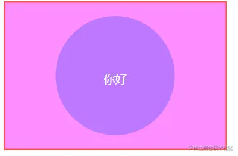

# 学习SVG（一）入门指南

## SVG是什么

- SVG是一种XML应用，用来表示可伸缩的矢量图形。
- 通过XML文本来描述二维图形和绘图程序的语言。

## SVG的优势

- 图像质量不下降的情况下放大。
- 所有的图形有关信息被存储为纯文本，具有XML的开放性、可移植性和可交互性。
- 在`HTML`中使用时，每个形状都有一个对象，可以将事件处理程序附加到每个对象上。

## 简单的 SVG 示例

```html
<!DOCTYPE html>
<html lang="en">
  <head>
    <meta charset="UTF-8" />
    <meta http-equiv="X-UA-Compatible" content="IE=edge" />
    <meta name="viewport" content="width=device-width, initial-scale=1.0" />
    <title>Document</title>
  </head>
  <style type="text/css"></style>
  <body>
    <svg version="1.1" xmlns="http://www.w3.org/2000/svg" baseProfile="full" width="300" height="200">
      <rect width="100%" height="100%" stroke="#FF5151" stroke-width="4" fill="#FF8EFF" />
      <circle cx="150" cy="100" r="80" fill="#BE77FF" />
      <text x="150" y="110" font-size="16" text-anchor="middle" fill="white">你好</text>
    </svg>
  </body>
</html>
```



- SVG 代码都是在 `<svg>` 元素中，这是根元素。`version` 属性可定义所使用的 SVG 版本，`xmlns` 属性可定义 SVG 命名空间。
- 使用 `<rect>` 绘制了一个矩形。`stroke`设置边框颜色。`stroke-width`设置边框宽度。`fill`设置矩形的背景颜色。
- 使用 `<circle>` 绘制了一个圆形。`cx`和`cy`设置元素在svg中的位置，(0,0)位于视口的左上角。
- 使用 `<text>` 绘制了一个文本。`x`和`y`设置元素在svg中的位置。`font-size`设置字体大小。`text-anchor`设置文本排序。
- SVG 中元素渲染顺序是后面渲染的元素覆盖前面渲染的元素。

## 在网页中使用SVG

- 最简单方式就是和示例一样在`HTML`中，创建`<svg>` 元素绘制图形。也只有这种方式，我们才能操作SVG中的对象。
- 将SVG作为图像:

1. 使用`img`标签引入。

```html

```

1. 使用`css`引入。

```css
div{
 background: url(./1.svg) no-repeat;
}
```

- 将SVG作为应用程序:

1. 使用`object`标签引入。

```html
<object data="1.svg" type="image/svg+xml" />
```

1. 使用`iframe`标签引入。

```html
<iframe src="image.svg"></iframe>
```

- 还有一些其他标签也可以引入，这里就不一一写出来了。

## 总结

这里只是简单的介绍了一下什么是SVG，通过本节能知道SVG和画布一样都是用来绘制图形的。SVG的优势在与我们能直接获取每一个节点元素，然后使用 `JS` 和 `CSS` 操作。在实现动画效果时也更加的轻松。
