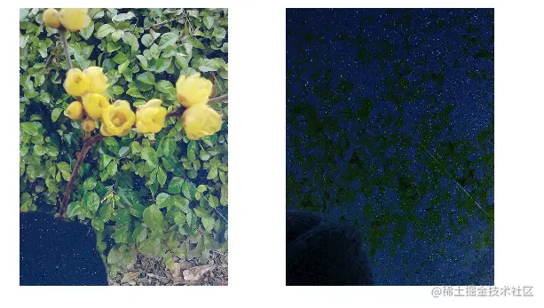

# 学习SVG（十）滤镜

## 什么是滤镜

- 使用滤镜后，在SVG中不会直接将图形渲染到画布上。是先将图形的像素保存到缓存中，然后将滤镜指定的操作应用图形的像素对象中，然后在把新的图形像素对象展示在画布上。
- 使用`filter`元素指定一组（滤镜元素），在渲染图形对象时，将该操作应用在最终图形上。

## [滤镜元素](https://link.juejin.cn?target=https%3A%2F%2Fdeveloper.mozilla.org%2Fzh-CN%2Fdocs%2FWeb%2FSVG%2FElement%23%E6%BB%A4%E9%95%9C%E5%85%83%E7%B4%A0)

```js
feBlend 
feColorMatrix
feComponentTransfer
feComposite
feConvolveMatrix
feDiffuseLighting
feDisplacementMap
feFlood
feGaussianBlur
feImage
feMerge
feMorphology
feOffset
feSpecularLighting
feTile
feTurbulence
feDistantLight
fePointLight
feSpotLight
```

- 滤镜元素有很多，每一个元素代表一种功能。

## 使用滤镜

- 需要使用 `<filter>` 标签来定义一个 SVG 滤镜。设置唯一标识`id`属性，SVG 图形使用这个 `id` 来引用滤镜。

1. 使用`feGaussianBlur`创建模糊效果。`in="SourceGraphic"`属性定义了模糊效果要应用于整个图片，`stdDeviation` 属性定义了模糊的程度。

```html
  <defs>
    <filter id="ga" x="0" y="0">
      <feGaussianBlur in="SourceGraphic" stdDeviation="2"></feGaussianBlur>
    </filter>
  </defs>
  <rect x="10" y="10" width="100" height="100" fill="#ccc" filter="url(#ga)"></rect>
```


1. 使用多个滤镜模拟阴影效果。

```html
  <defs>
    <filter id="ga" x="0" y="0">
      <feGaussianBlur in="SourceAlpha" stdDeviation="5" result="blur"></feGaussianBlur>
      <feOffset in="blur" dx="10" dy="10" result="offsetBlur"></feOffset>
      <feMerge>
        <feMergeNode in="offsetBlur" />
        <feMergeNode in="SourceGraphic" />
      </feMerge>
    </filter>
  </defs>
  <rect x="10" y="10" width="100" height="100" fill="black" filter="url(#ga)"></rect>
```


2.1 `in`属性简介：`SourceGraphic` 表示图形元素自身将作为 `<filter>` 原始输入。`SourceAlpha` 图形元素自身将作为 `<filter>` 原语的原始输入，只使用元素的非透明部分。

2.2 `result="blur"` 通过 `result`元素，产出一个中间滤镜，唯一标识为`blur`。其他滤镜通过`in`属性引入中间滤镜，在已有的效果上继续操作。

2.3 `feOffset`元素，创建位移效果。

2.4 `feMerge`元素，合并多个效果。子元素`feMergeNode`，获取滤镜的效果输出。

2.5 `<feMergeNode in="offsetBlur" />` 输出`offsetBlur`的结合滤镜效果。

2.6 `<feMergeNode in="SourceGraphic" />` 输出`SourceGraphic`图形元素自身。

- 到这里一个简单的滤镜应用就完成了。

## 其他滤镜使用

### feColorMatrix滤镜

- `feColorMatrix`元素，通过修改矩阵对颜色进行变换。

```html
  <defs>
    <filter id="matrix">
      <feColorMatrix
        type="matrix"
        values="
        0 0 0 0   0
        0 0 0 0.9 0
        0 0 0 0.9 0
        0 0 0 1   0
      "
      ></feColorMatrix>
    </filter>
  </defs>
  <text x="10" y="100" font-size="40" style="filter: url(#matrix)">你好 SVG</text>
```


### feBlend 滤镜

- 混合模式滤镜。允许使用任意的`JPG\PNG\SVG`文件或带有id属性SVG元素作为输入源。
- 模式:

1. `normal` — 正常
2. `multiply` — 正片叠底
3. `screen` — 滤色
4. `darken` — 变暗
5. `lighten`— 变亮

```html
  <defs>
    <filter id="ga" x="0" y="0" width="200" height="250">
      <feImage width="200" height="250" xlink:href="1.jpg" result="img1" />
      <feImage width="200" height="250" xlink:href="2.jpg" result="img2" />
      <feBlend mode="lighten" in="img1" in2="img2" />
    </filter>
  </defs>
  <rect x="10" y="10" width="200" height="250" fill="black" filter="url(#ga)"></rect>
```



- 第一张变亮效果，第二张变暗效果。

## 总结

本文简单的介绍了一下 SVG 滤镜的使用方式。SVG的滤镜很多，有的很复杂能单独开一节将，有的很简单直接就能使用，后面会单独对一些滤镜做讲解。推举大家看张鑫旭大佬的文章。

- [深入理解SVG feDisplacementMap滤镜及实际应用](https://link.juejin.cn?target=https%3A%2F%2Fwww.zhangxinxu.com%2Fwordpress%2F2017%2F12%2Funderstand-svg-fedisplacementmap-filter%2F)