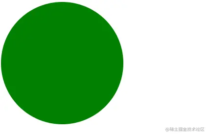
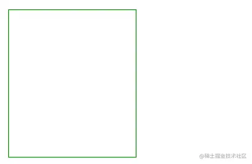
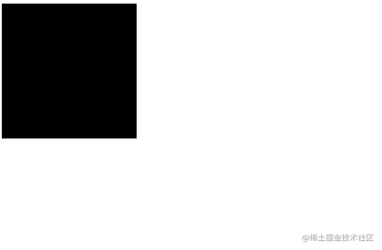
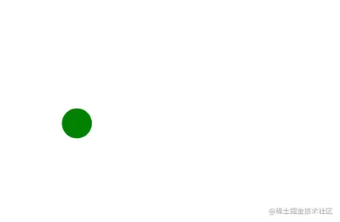
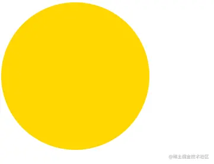

# 学习SVG（十一）动画

## SVG中的动画

- 在SVG中动画是根据SMIL规范来进行开发的。
- SVG中有4个动画元素：

1. `set` 实现延迟功能。在规定时间之后，修改某个属性的值。
2. `animate` 实现单属性的过渡动画。
3. `animateTransform` 用于实现`transform`变换动画。
4. `animateMotion` 实现路径动画，让SVG各个图形，沿着指定路径运动。

### set

- 常用属性：

1. `attributeName` 属性名称。
2. `attributeType` 属性类型，参数 `CSS/XML/auto`。默认值auto。
3. `to`  变化到的值。
4. `begin` 延迟时间。

```html
<circle cx="100" cy="100" r="100" fill="green" stroke="none">
    <set attributeName="cx" to="160" begin="2s" />
</circle>
```



### animate

- 常用属性：

1. `attributeName` 属性名称。
2. `attributeType` 属性类型，参数 `CSS/XML/auto`。默认值auto。
3. `from` 属性开始值。
4. `to` 属性结束值。
5. `dur` 动画过渡时间。
6. `repeatCount` 动画重复次数。设置为 indefinite 表示无限循环，一直执行。
7. `fill` 动画结束后，freeze表示冻结，remove表示恢复。

```html
<rect x="10" y="10" width="200" height="200" stroke="green" fill="none">
    <animate attributeName="width" attributeType="XML" from="200" to="20" dur="5s" repeatCount="2"></animate>
</rect>
```



### animateTransform

- 常用属性：

1. `attributeName` 属性名称。
2. `attributeType` 属性类型，参数 `CSS/XML/auto`。默认值auto。
3. `repeatCount` 动画重复次数。
4. `type` `transform`变换类型。

```html
<rect x="-10" y="-10" width="40" height="40" fill="ff9">
    <animateTransform
      attributeType="XML"
      attributeName="transform"
      type="scale"
      from="1"
      to="4"
      dur="3s"
      fill="freeze"
    ></animateTransform>
</rect>
```



### animateMotion

- 常用属性：

1. `attributeName` 属性名称。
2. `attributeType` 属性类型，参数 `CSS/XML/auto`。默认值auto。
3. `path` 定义路径。
4. `dur` 动画过渡时间。

```html
<circle cx="10" cy="10" r="15" fill="green" stroke="none">
    <animateMotion path="M50,135C100,25 150,225 200,125" dur="6s" fill="freeze"></animateMotion>
</circle>
```



## CSS操作SVG动画

- 在内联模式下，`SVG元素`作为`html`标签。直接成为DOM的一部分，我们就能使用CSS直接控制。

### 简单使用

```html
...
    #cir {
      fill: gold;
    }
    #cir:hover {
      fill: greenyellow;
    }
...

<circle id="cir" cx="100" cy="100" r="100" fill="green" stroke="none"></circle>

...
```



### 时钟动画

```html
<style type="text/css">
    .fast-line {
      animation: rotateName 2s linear infinite;
    }
    .slow-line {
      animation: rotateName 15s linear infinite;
    }
    @keyframes rotateName {
      0% {
        transform: rotate(0deg);
      }
      100% {
        transform: rotate(360deg);
      }
    }
</style>

...

<svg height="100" width="100" viewBox="-52 -52 104 104">
  <circle fill="none" stroke="#DE3E35" stroke-width="6" stroke-miterlimit="10" cx="0" cy="0" r="48" />
  <line
    class="fast-line"
    fill="none"
    stroke-linecap="round"
    stroke="#DE3E35"
    stroke-width="6"
    stroke-miterlimit="10"
    x1="0"
    y1="0"
    x2="35"
    y2="0"
  ></line>
  <line
    class="slow-line"
    fill="none"
    stroke-linecap="round"
    stroke="#DE3E35"
    stroke-width="6"
    stroke-miterlimit="10"
    x1="0"
    y1="0"
    x2="0"
    y2="24"
  ></line>
</svg>
```


1. 先创建一个静态的时钟。这里要注意使用了`viewBox`修改了可视区位置，因为SVG的旋转是整个坐标系旋转，所以已坐标原点为中心进行绘制。
2. SVG元素也在DOM中，使用类选择器选中`line`元素。
3. 开始使用CSS的动画属性`animation`。不断的修改`line`元素的`rotate`角度，完成长短针的旋转。

## 总结

本文主要了解了SVG的动画和结合CSS实现动画。除了CSS实现动画，通过JavaScript也能实现动画。当然需要分析一下动画的复杂度，简单的动画完全没必要使用JavaScript。