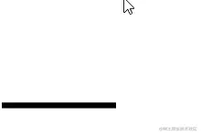

# 学习SVG（十二）路径描边动画

## 概述

在SVG中有个比较重要的属性分支，`stroke`(描边)。本节讲解的动画就是围绕它展开的。

- 常用属性：

1. `stroke` 描边颜色。
2. `stroke-width` 描边的粗细。
3. `stroke-linecap` 表示描边端点表现方式。
4. `stroke-dasharray` 虚线描边，设置虚线长度。
5. `stroke-dashoffset` 虚线的起始偏移，值为，百分比值，长度值。
6. `stroke-opacity` 描边透明度。

- 描边动画就是使用`stroke-dasharray`和`stroke-dashoffset`属性来完成。

## 开始使用

```html
  <line
    fill="none"
    stroke="#000000"
    stroke-width="5"
    stroke-dasharray="100"
    stroke-dashoffset="100"
    x1="0"
    y1="90"
    x2="100"
    y2="90"
  >
    <animate
      attributeName="stroke-dashoffset"
      attributeType="XML"
      from="100"
      to="0"
      dur="2s"
      fill="freeze"
    ></animate>
  </line>
```



1. 先设置好虚线的距离，在设置虚线的偏移长度为线的长度，这样画布上就是空白状态。
2. 通过`animate`元素添加过度效果，缓慢的减少偏移位置，虚线就慢慢的展示。

## 文字描边

```html
  <style type="text/css">
    text {
      font-size: 64px;
      font-weight: bold;
      fill: none;
      stroke-width: 2px;
      stroke-dasharray: 100 300;
      animation: stroke 6s infinite linear;
    }
    .textA {
      stroke: #3498db;
      text-shadow: 0 0 5px #3498db;
    }
    @keyframes stroke {
      100% {
        stroke-dashoffset: -400;
      }
    }
  </style>
  
...
    <text class="textA" text-anchor="middle" x="50%" y="50%">文字描边</text>
...
```


1. 创建文本元素，添加文本。
2. 使用CSS选择器设置文本元素样式。
3. 使用CSS的动画属性，`@keyframes`移动虚线位置。一个文本的描边就完成了。

- 上面设置的虚线长度300，最后会出现空白部分。这样做是是因为它还不是最终状态，一种颜色过于单调，为效果更加好看，下面我们继续添加虚线。

```html
...
    .textB {
      stroke: #f39c12;
      text-shadow: 0 0 5px #f39c12;
      animation-delay: -2s;
    }
    .textC {
      stroke: #9b59b6;
      text-shadow: 0 0 5px #9b59b6;
      animation-delay: -4s;
    }
...

...
    <text class="textB" text-anchor="middle" x="50%" y="50%">文字描边</text>
    <text class="textC" text-anchor="middle" x="50%" y="50%">文字描边</text>
...

```


1. 为了颜色连贯，设置虚线长度为`100 300`。
2. 使用`animation-delay`延迟其他颜色的执行，形成交错效果。
3. 这里需要注意，虚线长度和颜色的多少需要协调，动画时长和不同颜色的等待时间也需要协调。

## 路径动画

- 前面使用的是`animation`，这里使用`transition`和`:hover`实现选中动画效果。

```html
...
<style type="text/css">
    .svg-box:hover .will-show {
      stroke-dashoffset: 0;
    }
    path {
      transition: stroke-dashoffset 0.5s linear 0s;
    }
</style>
...

<g class="svg-box" fill="none" fill-rule="evenodd">
<path
  stroke="#C8C9CC"
  stroke-width="7"
  d="M20.657 107c-.422 0-.834-.014-1.225-.04-1.63-.116-2.62-.5-3.029-1.176-.552-.917.025-2.22.635-3.601.329-.682.595-1.392.795-2.122l.117-.507c.522-2.25 1.61-6.933.8-10.059a45.674 45.674 0 01-8.63-13.586A42.2 42.2 0 0111.165 41.7a46.975 46.975 0 0111.357-14.937 53.67 53.67 0 0116.846-10.07 59.469 59.469 0 0141.26 0 53.685 53.685 0 0116.849 10.07A46.99 46.99 0 01108.834 41.7a42.246 42.246 0 010 36.581 46.964 46.964 0 01-11.357 14.937 53.645 53.645 0 01-16.848 10.071 59.465 59.465 0 01-41.212.018h-.215a30.31 30.31 0 00-7.62 1.597l-.074.02-.798.233A37.015 37.015 0 0120.656 107z"
></path>
<path
  class="will-show"
  stroke="#4C9AF2"
  stroke-width="7"
  stroke-dasharray="330"
  stroke-dashoffset="330"
  d="M20.657 107c-.422 0-.834-.014-1.225-.04-1.63-.116-2.62-.5-3.029-1.176-.552-.917.025-2.22.635-3.601.329-.682.595-1.392.795-2.122l.117-.507c.522-2.25 1.61-6.933.8-10.059a45.674 45.674 0 01-8.63-13.586A42.2 42.2 0 0111.165 41.7a46.975 46.975 0 0111.357-14.937 53.67 53.67 0 0116.846-10.07 59.469 59.469 0 0141.26 0 53.685 53.685 0 0116.849 10.07A46.99 46.99 0 01108.834 41.7a42.246 42.246 0 010 36.581 46.964 46.964 0 01-11.357 14.937 53.645 53.645 0 01-16.848 10.071 59.465 59.465 0 01-41.212.018h-.215a30.31 30.31 0 00-7.62 1.597l-.074.02-.798.233A37.015 37.015 0 0120.656 107z"
></path>
</g>

...
```


1. 先创建一条路径，设置其描边和颜色为初始状态。在创建一条一模一样路径，设置其虚线距离为总长度。
2. 通过CSS选择器，选择其父级设置`:hover`效果。修改`stroke-dashoffset`(偏移)为0。
3. 在选中`path`元素，并设置过度动画。

- 一个简单的选中效果动画就完成了。