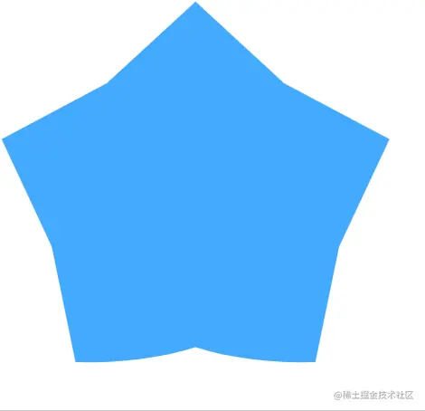

# 学习SVG（十三）使用GSAP制作动画

## 简介

- 能实现SVG动画的框架有很多，本节学习的是`GSAP`。优势：

1. 学习成本低，能很快的上手。
2. 性能好，内部专门优化了动画性能。
3. 模块化，内部功能模块化，我们可以按需引入减少文件大小。
4. 拥有操作时间轴功能，对制作线性动画有很大帮助。
5. 社区强大，网上很多样例。

- `GSAP`是一个JavaScript库，除了控制`SVG`外，其他的如`DOM对象`或则`canvas的对象`都可以使用它来制作动画。

## 开始使用 GSAP

- 在开始使用前需要知道其核心模块：

1. **TweenMax** 核心动画工具，可用来构建补间动画。**TweenLite**简化版。
2. **TimelineMax** 创建时间轴（timeline）作为动画或其他时间轴的容器，这使得整个动画控制和精确管理时间变得简单。**Timelineline**简化版。

- **需要注意GSAP不是完全免费的，不过有着有着比较宽松的授权。只有用于访客付费才可浏览内容的网站（例如收费视频网站）或应用才需要购买授权。**
- 这里就不详细介绍，大家可以去官网看详细介绍。
- [中文文档地址](https://link.juejin.cn?target=https%3A%2F%2Fwww.tweenmax.com.cn%2Findex.html)

### CDN

[官网 CDN地址](https://link.juejin.cn?target=https%3A%2F%2Fgreensock.com%2Fdocs%2Fv3%2FInstallation%3Fchecked%3Dcore%23CDN)

```html
<script src="https://cdnjs.cloudflare.com/ajax/libs/gsap/3.10.3/gsap.min.js"></script>
```

### 补间动画

```html
<g fill="none" fill-rule="evenodd" stroke="#9fbde8">
    <g transform="translate(1 1)" stroke-width="2">
      <circle id="circle1" cx="5" cy="50" r="5"></circle>
      <circle id="circle2" cx="27" cy="5" r="5"></circle>
      <circle id="circle3" cx="49" cy="50" r="5"></circle>
    </g>
</g>
... 
<script src="https://cdnjs.cloudflare.com/ajax/libs/gsap/3.10.3/gsap.min.js"></script>
<script type="text/javascript">
      const tem = [
        { cy: 50, cx: 5 },
        { cy: 5, cx: 27 },
        { cy: 50, cx: 49 },
        { cy: 50, cx: 5 }
      ]
      tem.forEach((item, index) => {
        gsap.to('#circle1', 0.2, {
          cy: item.cy,
          cx: item.cx,
          repeat: -1,
          delay: 0.2 * index,
          repeatDelay: 0.6
        })
      })

      const tem2 = [
        { cy: 5, cx: 27 },
        { cy: 50, cx: 49 },
        { cy: 50, cx: 5 },
        { cy: 5, cx: 27 }
      ]
      tem2.forEach((item, index) => {
        gsap.to('#circle2', 0.2, {
          cy: item.cy,
          cx: item.cx,
          repeat: -1,
          delay: 0.2 * index,
          repeatDelay: 0.6
        })
      })

      const tem3 = [
        { cy: 50, cx: 49 },
        { cy: 50, cx: 5 },
        { cy: 5, cx: 27 },
        { cy: 50, cx: 49 }
      ]
      tem3.forEach((item, index) => {
        gsap.to('#circle3', 0.2, {
          cy: item.cy,
          cx: item.cx,
          repeat: -1,
          delay: 0.2 * index,
          repeatDelay: 0.6
        })
      })
</script>
```


- `gsap.to` target: 需要动画的对象。 duration：动画持续时间，一般是秒。 vars 动画参数（CSS属性、延迟、重复次数等）。会自动分辨那些是控制属性。

1. 使用`gsap.to`创建补间动画。控制`cy、cx`的变换。
2. 一个元素执行了4个变换，分配好延迟执行时间（`delay`）和重复动画之前等待时间（`repeatDelay`）。

### 形状变化 动画

```html
...
<svg width="500" height="500">
  <path
    id="star"
    d="M185,1.12977573 L128.163889,116.292316 L1.07448057,134.759488 L93.0372403,224.401023 L71.3277776,350.976903 L185,291.215879 L298.672222,350.976903 L276.96276,224.401023 L368.925519,134.759488 L241.836111,116.292316 L185,1.12977573 Z"
    fill="#4af"
  ></path>

  <path
    id="end"
    d="M160,0 L258.885438,32 L320,110.557281 L320,210.424346 L258.885438,289.442719 C217.122754,309.81424 184.160941,320 160,320 C135.839059,320 102.877246,309.81424 61.1145618,289.442719 L0,210.424346 L0,110.557281 L61.1145618,32 L160,0 Z"
    fill="transparent"
  ></path>
</svg>
<script src="https://cdnjs.cloudflare.com/ajax/libs/gsap/3.10.3/gsap.min.js"></script>
<script src="https://s3-us-west-2.amazonaws.com/s.cdpn.io/16327/MorphSVGPlugin3.min.js"></script>
<script type="text/javascript">
  // 创建时间轴动画
  let tl = gsap.timeline({
    repeat: -1, // 重复次数
    yoyo: true, // 重复的动画将往返进行
    repeatDelay: 0.3, // 第二次动画等待时间
    defaults: {
      duration: 3 // 设置时间轴的持续时间
    }
  })

  // 添加动画  形状变化
  // 这里使用了 Plugin(插件) 控制SVG path元素的d变化
  tl.to('#star', { morphSVG: '#end' })
</script>
...
```



- 创建一个时间轴动画，然后添加（`to`）一个动画进入，使用`morphSVG`属性修改**path元素的d属性**。
- 这里使用`MorphSVGPlugin3`SVG不规则变形动画插件。该插件为收费版，这里使用的是试用版本。