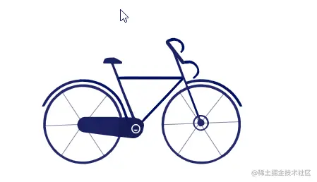

# 学习SVG（十四）为静态SVG添加动画

## 简介

前面我们了解`GSAP`这个JavaScript库的使用，本节我们就通过它使静态SVG动起来。

## 获取SVG文件

- 画出一个精美的SVG图案需要大量时间。所以我们需要在一些免费的网站上寻找。如[iconfont](https://link.juejin.cn?target=https%3A%2F%2Fwww.iconfont.cn%2F)、[Iconfinder](https://link.juejin.cn?target=https%3A%2F%2Fwww.iconfinder.com%2Ficons)、[icons8](https://link.juejin.cn?target=https%3A%2F%2Ficons8.com%2Ficons)等网站。
- 下载文件，复制到我们的页面中。**注意：只有直接写在html文档中的SVG元素，才能操作其DOM。**

## 操作DOM

- 先分析SVG中那个图形，对应那个DOM。然后使用框架操作其属性形成动画。
- 这里就不把代码贴出来了，SVG代码非常的多。

```html
<script src="https://cdnjs.cloudflare.com/ajax/libs/gsap/3.10.3/gsap.min.js"></script>
<script type="text/javascript">
  const tl = new TimelineMax()
  tl.staggerFrom(
    ['#svgCar > .st2', '#svgCar > .st1', '#svgCar > #图层_3 rect'],
    1,
    {
      scaleY: 0,
      scaleX: 0,
      transformOrigin: 'center',
      ease: Bounce.easeOut
    },
    0.2
  )
</script>
```


- 引入`gsap`库。
- 使用`TimelineMax`中的[`staggerFrom()`](https://link.juejin.cn?target=https%3A%2F%2Fwww.tweenmax.com.cn%2Fapi%2Ftimelinemax%2FstaggerFrom())方法。

1. 为一组目标设定相同的起点变化属性，但是错开一定的时间，创建成一个间隔均匀的动画序列。
2. 第一个参数：DMO节数组。第二个参数：每个动画持续时间。第三个参数：动画参数。第四个参数：每个动画的开始时间间隔，默认为0。

- 初始设置`scaleY、scaleX`为0，隐藏图形，配置好动画速度和起点。`gsap`会帮我们进行补间动画的计算。
- 给每一个DOM都加上动画。

```js
      const t2 = new TimelineMax()
      t2.staggerFrom(
        ['#svgCar > .st0', '#svgCar > .st3', '#svgCar > .st15', '#svgCar > .st16'],
        1,
        {
          scaleX: 0,
          transformOrigin: 'left',
          ease: Bounce.easeOut
        },
        0.1
      )

      const t3 = new TimelineMax()
      t3.staggerFrom(
        [
          '#svgCar > .st4',
          '#svgCar > .st5',
          '#svgCar > .st6',
          '#svgCar > .st7',
          '#svgCar > .st8',
          '#svgCar > .st10',
          '#svgCar > .st11',
          '#svgCar > .st12',
          '#svgCar > .st13'
        ],
        1,
        {
          scaleY: 0,
          transformOrigin: 'top',
          ease: Bounce.easeOut
        },
        0.1
      )

      const t4 = new TimelineMax()
      t4.staggerFrom(
        ['#svgCar > .st9', '#svgCar > #图层_2 .st4'],
        1,
        {
          scaleX: 0,
          transformOrigin: 'right',
          ease: Bounce.easeOut
        },
        0.1
      )
```



- 这里每一次都创建了`TimelineMax`，因为只在一条时间线上执行需要很久，反而会使动画用户体验下降。
- [代码地址](https://link.juejin.cn?target=https%3A%2F%2Fgithub.com%2Fnie-ny%2Fblog%2Fblob%2Fmain%2F%E6%96%87%E7%AB%A0%2FSVG%2F%E5%AD%A6%E4%B9%A0SVG%EF%BC%88%E5%8D%81%E5%9B%9B%EF%BC%89%E4%B8%BA%E9%9D%99%E6%80%81SVG%E6%B7%BB%E5%8A%A0%E5%8A%A8%E7%94%BB.html)

## 总结

- 本节我们简单了解，如何给一个静态SVG添加动画。这里的动画过于简单，想绘制更炫酷的动画步骤和这个一样，不同的是需要使用其他方法或控制其它DOM属性。