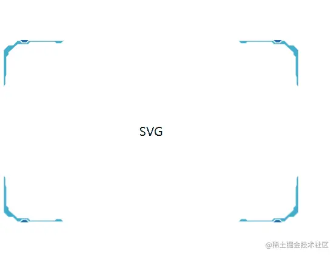

# 学习SVG（十五）绘制闪烁边框

## 简介

- 边框在开发中是很长见的样式，大多数时候都是使用静态的。为了提高用户体验添加动态的边框是必不可少的。

## 绘制边框

- 绘制左上角边框样式。

```html
    <svg width="150px" height="150px">
      <g id="left-polygon">
        <polygon
          id="polygon1"
          points="6,66 6,18 12,12 18,12 24,6 27,6 30,9 36,9 39,6 84,6 81,9 75,9 73.2,7 40.8,7 37.8,10.2 24,10.2 12,21 12,24 9,27 9,51 7.8,54 7.8,63"
          fill="#4fd2dd"
        ></polygon>
        <polygon
          id="polygon2"
          points="27.599999999999998,4.8 38.4,4.8 35.4,7.8 30.599999999999998,7.8"
          fill="#235fa7"
        ></polygon>
        <polygon
          id="polygon3"
          points="9,54 9,63 7.199999999999999,66 7.199999999999999,75 7.8,78 7.8,110 8.4,110 8.4,66 9.6,66 9.6,54"
          fill="#4fd2dd"
        ></polygon>
      </g>
    </svg>
```


- 使用`polygon`元素，绘制3个多边形组合成一个左上角的边框。
- 每个`polygon`元素都有唯一标识用于动画控制。

### 添加闪烁动画

```html
<script src="https://cdnjs.cloudflare.com/ajax/libs/gsap/3.10.3/gsap.min.js"></script>
<script type="text/javascript">
  const tem1 = ['#4fd2dd', '#235fa7', '#4fd2dd']
  tem1.forEach((item, index) => {
    gsap.to('#polygon1', 0.2, {
      fill: item,
      repeat: -1,
      delay: 0.2 * index,
      repeatDelay: 0.6
    })
  })
  const tem2 = ['#235fa7', '#4fd2dd', '#235fa7']
  tem2.forEach((item, index) => {
    gsap.to('#polygon2', 0.2, {
      fill: item,
      repeat: -1,
      delay: 0.2 * index,
      repeatDelay: 0.6
    })
  })
  const tem3 = ['transparent', '#4fd2dd', '#235fa7']
  tem3.forEach((item, index) => {
    gsap.to('#polygon3', 0.2, {
      fill: item,
      repeat: -1,
      delay: 0.2 * index,
      repeatDelay: 0.6
    })
  })
</script>
```


- 通过唯一标识获取元素，然后根据时间修改背景颜色。
- 除了使用`gsap`，SVG自身也能实现这个动画效果，还更简单。

```html
--- polygon1
<animate
    attributeName="fill"
    values="#4fd2dd;#235fa7;#4fd2dd"
    dur="0.6s"
    begin="0s"
    repeatCount="indefinite"
></animate>
```

- 在`polygon1`元素中使用，和使用动画库的效果差不多。

### 添加其他边框

- 如果4个角的样式都不一样就需要在每个角绘制样式。
- 当4个角的样式一样，我们把绘制的组合图形当做一个模板。复制4份，通过位移、翻转到指定位置已完成完整的边框。

1. 使用`defs`元素创建模板。

```html
<svg width="150px" height="150px">
    <defs>
     ... g -- id='left-polygon'
    </defs>
</svg>
```

1. 使用`use`复制4份。

```html
<div class="frame_div">
  <svg class="left-top">
    <use xlink:href="#left-polygon" />
  </svg>
  <svg class="right-top">
    <use xlink:href="#left-polygon" />
  </svg>
  <svg class="left-bottom">
    <use xlink:href="#left-polygon" />
  </svg>
  <svg class="right-bottom">
    <use xlink:href="#left-polygon" />
  </svg>
  <span>SVG</span>
</div>
```


1. 使用css，控制边框到指定位置。

```css
.frame_div {
  width: 400px;
  height: 250px;
  position: relative;
  display: flex;
  align-items: center;
  justify-content: center;
}
.left-top {
  position: absolute;
  top: 0;
  left: 0;
}

.right-top {
  position: absolute;
  top: 0;
  right: 0;
  transform: rotateY(180deg);
}

.left-bottom {
  position: absolute;
  bottom: 0;
  left: 0;
  transform: rotateX(180deg);
}

.right-bottom {
  position: absolute;
  right: 0;
  bottom: 0;
  transform: rotateX(180deg) rotateY(180deg);
}
```



- 一个带有闪烁动画的边框就完成了。

## 总结

本节实现了一个闪烁边框。单独使用SVG或则CSS都能实现，不过代码量也会变多。学会了SVG以后，配合CSS能使用少量的代码实现复杂的动画。