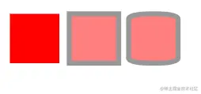
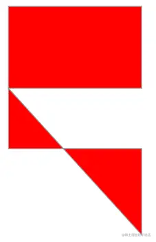

# 学习SVG（三）基本形状

## 基本形状

### 线段

- `line`元素。

1. `x1,y1,x2,y2` 指定线段的起止点坐标。
2. `stroke-width` 线段宽度。
3. `stroke` 线段颜色。
4. `stroke-opacity` 线段透明度。
5. `stroke-dasharray` 设置虚线。线段长度。

```js
    <svg width="100" height="100">
      <line x1="10" y1="10" x2="90" y2="10" stroke="red" stroke-width="3"></line>
      <line x1="10" y1="30" x2="90" y2="30" stroke="red" stroke-width="3" stroke-opacity="0.5"></line>
      <line
        x1="10"
        y1="50"
        x2="90"
        y2="50"
        stroke="red"
        stroke-width="3"
        stroke-opacity="0.5"
        stroke-dasharray="5"
      ></line>
    </svg>
```


### 矩形

- `rect`元素。

1. `x,y,width,height` 设置一个矩形。
2. `fill` 填充颜色。
3. `fill-opacity` 填充透明度。
4. `stroke` 边框颜色。
5. `stroke-width` 边框宽度。
6. `rx/ry` 圆角设置。

```js
    <svg width="200" height="100">
      <rect x="10" y="10" width="50" height="50" fill="red"></rect>
      <rect x="70" y="10" width="50" height="50" fill="red" fill-opacity="0.5" stroke="#979797" stroke-width="5"></rect>
      <rect
        x="130"
        y="10"
        width="50"
        height="50"
        fill="red"
        fill-opacity="0.5"
        stroke="#979797"
        stroke-width="5"
        rx="20"
        ry="5"
      ></rect>
    </svg>
```



### 圆和椭圆

- `circle` 元素，圆。

1. `cx,cy,r` 设置一个圆。

- `ellipse` 元素，椭圆。

1. `cx,cy,rx,ry` 设置一个椭圆。

- 它们的属性是一样的。

1. `fill` 填充颜色。
2. `fill-opacity` 填充透明度。
3. `stroke` 边框颜色。
4. `stroke-width` 边框宽度。

```html
    <svg width="400" height="400">
      <circle cx="50" cy="50" r="50" fill="red"></circle>
      <ellipse cx="180" cy="50" rx="70" ry="50" fill="red"></ellipse>

      <circle cx="60" cy="180" r="50" fill="red" fill-opacity="0.5" stroke="#979797" stroke-width="5"></circle>
      <ellipse
        cx="190"
        cy="180"
        rx="70"
        ry="50"
        fill="red"
        fill-opacity="0.5"
        stroke="#979797"
        stroke-width="5"
      ></ellipse>
    </svg>
```


### 多边形

- `polygon`元素。

1. 由`points`属性指定的一系列坐标点，会自动封闭。
2. `fill` 填充颜色。
3. `fill-opacity` 填充透明度。
4. `stroke` 边框颜色。
5. `stroke-width` 边框宽度。
6. `fill-rule` 填充规则，如果多边形有交叉需要指定。

```html
    <svg width="400" height="400">
      <polygon points="5,5 160,5 160,100 5,100 5,5" fill="red" stroke="#979797"></polygon>
      <polygon points="5,170 160,170 160,270 5,100 5,170" fill="red" stroke="#979797"></polygon>
    </svg>
```



### 折线

- `polyline`元素。

1. 由`points`属性指定一系列点，不自动封闭。

```html
    <svg width="400" height="400">
      <polyline points="10,10 30,10 30,30 50,30 50,50 70,50" fill="white" stroke="red" stroke-width="3"></polyline>

      <polyline points="10,50 70,75 80,60 80,120 120,140 200,180" style="fill: none; stroke: black; stroke-width: 3" />
    </svg>
```


- 除了直接设置属性的方式，还可以通过设置css的方式来设置svg元素的属性。

### 路径

- `path`元素。

1. 由`d`属性设置。不是单纯的点，通常是一组命令。后面会详细了解。
2. 也拥有形状的基础属性。

```js
    <svg width="400" height="400">
      <path d="M0 25 L25 0 L50 25 L75 0 L100 25 L 50 75 Z" stroke="#979797" fill="#D8D8D8"></path>
    </svg>
```

