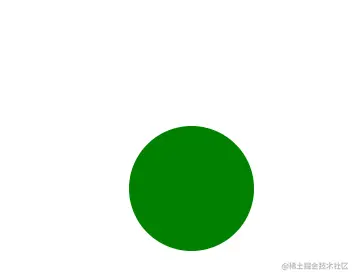
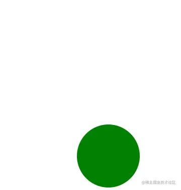
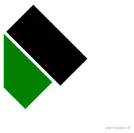
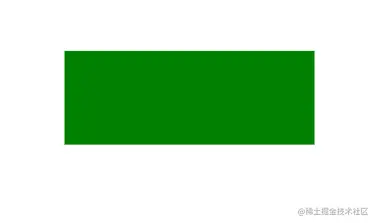
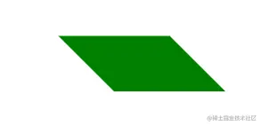

# 学习SVG（五）坐标系统变换

## 简介

SVG中自带`transform`属性，控制图形的坐标变换。它与`css3`中的`transform`是有区别的，`css3`中变换是以元素的中心点变换，SVG中中的`transform`是相对于画布的左上角计算的。

## translate 位移

- 用于设置元素的位移变换。
- 参数格式 `translate(tx[ ty])` 参数值之间使用逗号`,`或者直接空格分隔，但是不能包含单位。

```js
    <svg width="400" height="400">
      <circle cx="50" cy="50" r="50" fill="green" stroke="none" transform="translate(100 100)"></circle>
    </svg>
```



- 位移也是支持多声明累加的。

```html
    <svg width="400" height="400">
      <circle
        cx="50"
        cy="50"
        r="50"
        fill="green"
        stroke="none"
        transform="translate(100 100) translate(20 100)"
      ></circle>
```

- 这里相当于`translate(120 200)`。



## rotate 旋转

- 用于设置元素的旋转变换。需要注意，旋转的是整个坐标不是元素本身，其中心点是画布的左上角。
- 参数格式`rotate(angle [ x y])`。`angle`代表旋转角度，`[ x y]`可选参数设置旋转中心点，参数都不能包含单位。

```html
  <rect x="20" y="30" width="100" height="50" fill="green" transform="rotate(45)" />
  <rect x="20" y="30" width="100" height="50" fill="black" transform="rotate(45 60 40)" />
```



## scale缩放

- 缩放坐标系统。
- 参数格式`scale(sx[, sy])`。 `sx`表示横坐标缩放比例，`sy`表示纵坐标缩放比例，`sy`是可缺省的，如果缺失，表示使用和`sx`一样的值，也就是等比例缩放。

```html
<rect x="100" y="50" width="100" height="50" fill="green" transform="scale(2,1.5)" />
```


- 因为是缩放坐标系统，元素的位置发生了变化，想以元素中心缩放就需要特殊处理。

```html
      <rect
        x="100"
        y="50"
        width="100"
        height="50"
        fill="green"
        transform="translate(150 75) scale(2,1.5) translate(-150 -75)"
      />
```



## skew斜切

- 坐标系统斜切变换。只支持X轴和Y轴分开设置，`skewX`或者`skewY`。
- 需要注意，多声明累加在一起的斜切变换是不一样的，因为是以画布的左上角为圆心的。

```html
<rect x="20" y="30" width="100" height="50" fill="green" transform="skewX(45)" />
```



## matrix 矩阵变换

- 用于设置元素的，平移、旋转、缩放等。
- [理解CSS3 transform中的Matrix(矩阵)](https://link.juejin.cn?target=https%3A%2F%2Fwww.zhangxinxu.com%2Fwordpress%2F2012%2F06%2Fcss3-transform-matrix-%e7%9f%a9%e9%98%b5%2F)，其原理和`css3`中矩阵一样。

```html
<rect x="20" y="30" width="100" height="50" fill="green" transform="matrix(1, 0, 0, 1, 30, 30)" />
```


- 设置位置偏移。