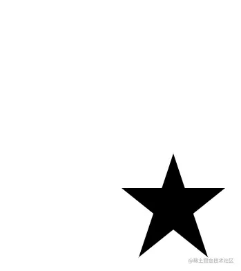
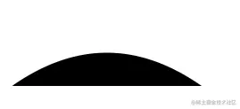
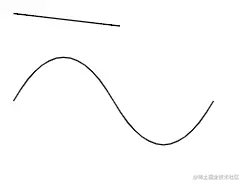
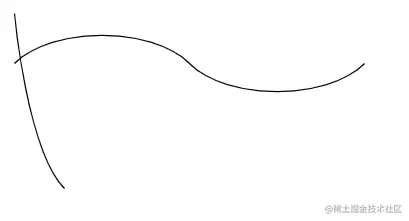

# 学习SVG（六）路径 - <path>

## path

- `<path>` 元素用来定义路径。
- 所有的基本形状它都能模拟，还能绘制不规则的图形，曲线等。
- `<path>` 元素的形状是通过属性`d`来定义的，属性`d`的值是一个**命令+坐标**的序列。

## path命令

- `path`命令是区分大小写的。大写表示绝对坐标，小写表示相对坐标。

1. `M m` 参数 `x y`坐标，移动画笔到指定坐标。
2. `L l` 参数 `x y`坐标，画笔当前坐标和指定坐标之间，画一条线段。
3. `H h` 参数 `x`坐标，绘制一条到给定x坐标的横线。
4. `V v` 参数 `y`坐标，绘制一条到给定y坐标的垂线。

- 直线图像是通过上面4个命令就能实现。
- 实现一个五角星。

```html
<path d="M 200 200 l -40 100 100 -80 -120 0 100 80 -40 -120 -40 120" fill="black" />
```



- 这里使用了小写`l`，每一次的坐标都是以上一次的坐标为原点开始计算。

1. `Q q` 参数 `x1 y1 x y`坐标，绘制一条从当前坐标到`x,y`坐标，控制点为`x1,y1`的二次贝塞尔曲线。

```html
<path d="M 10 80 Q 95 20 180 80" fill="black" />
```



1. `T t` 参数 `x y`坐标，绘制一条从当前坐标到`x,y`坐标的二次贝塞尔曲线。注意：`T`命令前面必须是一个`Q`或者`T`命令，才有会曲线效果。如果`T`命令单独使用，控制点就会被认为和终点是同一个点，画出来的是一条直线。

```html
    <path d="M10 10 T 95 20" stroke="black" fill="transparent" />
    <path d="M10 80 Q 50 10, 90 80 T 170 80" stroke="black" fill="transparent" />
```



1. `C c` 参数 `x1 y1 x2 y2 x y`，绘制一条从当前坐标到`x,y`坐标，控制点为`x1,y1 x2,y2`的三次贝塞尔曲线。

```html
<path d="M10 10 C 20 20, 40 20, 100 10" stroke="black" fill="transparent" />
```


1. `S s` 参数 `x2 y2 x y`，绘制一条从当前坐标到`x,y`坐标的三次贝塞尔曲线。注意：如果`S`命令跟在一个`C`命令或者另一个`S`命令的后面，它的第一个控制点，就会被假设成前一个控制点的对称点。如果`S`命令单独使用，前面没有`C`命令或者另一个`S`命令，那么它的两个控制点就会被假设为同一个点。

```html
  <path d="M 10 10 S 20 120, 50 150" stroke="black" fill="transparent" />
  <path d="M 10 50 C 40 20, 120 20, 150 50 S 260 80, 290 50" stroke="black" fill="transparent" />
```



1. `A a` 参数 `rx ry x-axis-rotation large-arc sweep x y`，绘制一个圆弧曲线。依次表示x方向半径、y方向半径、旋转角度、大圆标识、顺逆时针标识、目标点x、目标点y。

```html
      <path
        d="M10 315
          L 110 215
          A 20 70 0 0 1 162 166
          L 215 10"
        stroke="black"
        fill="transparent"
      />
```


1. `Z` 无参数，闭合路径。

```html
  <path d="M10 10 L 90 10  90 90 " stroke="black" fill="transparent" />
  <path d="M100 100 L 190 100  190 190 Z" stroke="black" fill="transparent" />
```

