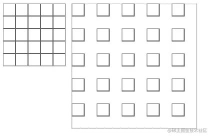
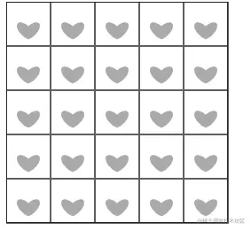
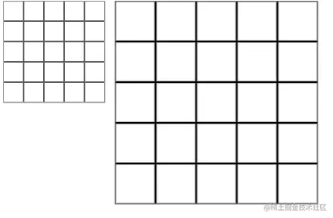
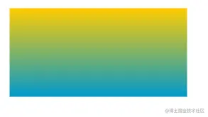
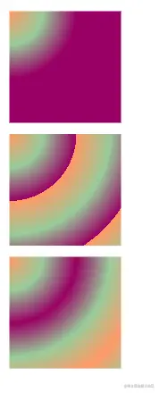

# 学习SVG（七）图案和渐变填充

## 简介

在SVG中图形的填充和轮廓除了使用纯色，还可以使用图案和渐变。

## 图案填充

- 图案填充需要使用`patterns`元素，填充类型之一。
- `patternUnits`属性设置图案如何排列。默认值`objectBoundingBox`。

1. 使用`objectBoundingBox`，图案的大小基于要填充对象的大小计算。

```html
    <svg width="400" height="400">
      <defs>
        <pattern id="pa" x="0" y="0" patternUnits="objectBoundingBox" width="20%" height="20%">
          <path d="M 0 0 h 20 v 20 h -20 z" style="stroke: black; fill: none"></path>
        </pattern>
      </defs>

      <rect width="100" height="100" stroke="#aaa" fill="url(#pa)" />
      <rect x="110" width="200" height="200" stroke="#aaa" fill="url(#pa)" />
    </svg>
```



1.2 设置了宽高20%。在图案中绘制了一个20px的正方形。第一个图20%小于20px正方形被截取，然后平铺图案。第二个图20%大于20px，图案变大，然后平铺图案。

1. 使用`userSpaceOnUse`属性根据`width和height`制定图案。

```html
  <pattern id="pa" x="0" y="0" patternUnits="userSpaceOnUse" width="40" height="40">
    <path d="M 0 0 h 40 v 40 h -40 z" style="stroke: black; fill: none"></path>
    <path d="M 20 22 A 5 10 -45 1 0 20 34" fill="#aaa" />
    <path d="M 20 22 A 5 10 45 1 1 20 34" fill="#aaa" />
  </pattern>

  <rect fill="url(#pa)" stroke="black" x="0" y="0" width="200" height="200" />
```



2.2 根据设置的`width和height`生成图案后平铺。

- `patternContentUnits`属性设置图案中图形宽高使用什么类型。默认值`userSpaceOnUse`。

1. `userSpaceOnUse` 使用默认坐标类型px设置图案的大小。
2. `objectBoundingBox` 使用百分比来设置图案的大小。

```html
      <defs>
        <pattern
          id="pa"
          x="0"
          y="0"
          width=".2"
          height=".2"
          patternUnits="objectBoundingBox"
          patternContentUnits="objectBoundingBox"
        >
          <path d="M 0 0 h 0.2 v 0.2 h -0.2z" style="stroke: black; stroke-width: 0.01; fill: none"></path>
        </pattern>
      </defs>
      <rect width="100" height="100" stroke="#aaa" fill="url(#pa)" />
      <rect x="110" width="200" height="200" stroke="#aaa" fill="url(#pa)" />
```



2.1 能看见图案中的正方形也是百分比计算的。

## 渐变色填充

- `linearGradient` 线性渐变，一系列颜色沿着一条直线过渡，在特定的位置指定想要的颜色。
- 属性:

1. `x1,y1` 渐变的起点位置，使用百分比表示，默认的渐变方向是从左到右。
2. `x2,y2` 渐变的终点位置，使用百分比表示。
3. `spreadMethod` 设置渐变填充方式。

```html
      <defs>
        <linearGradient id="linear" x1="100%" y2="100%">
          <stop offset="0%" style="stop-color: #ffcc00"></stop>
          <stop offset="100%" style="stop-color: #0099cc"></stop>
        </linearGradient>
      </defs>
      <rect x="10" y="10" width="200" height="100" fill="url(#linear)"></rect>
```



- `radialGradient` 径向渐变，每个渐变点是一个圆形路径，从中心点向外扩散。
- 属性:

1. `cx,cy,r` 定义渐变的范围，测量半径的单位是对象的宽高均值。默认值50%。
2. `fx,fy` 0%点所处的圆路径的圆心。
3. `spreadMethod` 设置绘制范围没有到达图形边缘的情况。

```html
      <defs>
        <radialGradient id="rad" cx="0%" cy="0%" r="60%">
          <stop offset="0%" style="stop-color: #f96" />
          <stop offset="50%" style="stop-color: #9c9" />
          <stop offset="100%" style="stop-color: #906" />
        </radialGradient>
        <radialGradient id="pad" xlink:href="#rad" spreadMethod="pad" />
        <radialGradient id="repeat" xlink:href="#rad" spreadMethod="repeat" />
        <radialGradient id="reflect" xlink:href="#rad" spreadMethod="reflect" />
      </defs>
      <rect x="10" y="10" width="100" height="100" fill="url(#pad)" />
      <rect x="10" y="120" width="100" height="100" fill="url(#repeat)" />
      <rect x="10" y="230" width="100" height="100" fill="url(#reflect)" />
```



- `stop`元素，设置渐变点。

1. `offset`属性，指定渐变点位置。取值范围0%-100%。
2. `stop-color`属性，对应`offset`位置点的颜色。
3. `stop-opacity`属性，对应`offset`位置点的不透明度。