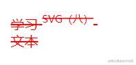
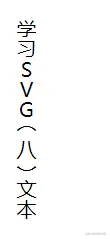

# 学习SVG（八）文本

## 简介

在SVG中除了绘图外，还可以添加文本。需要使用`<text>` 元素在画布中创建文本，使用`<tspan>`元素进行多行文本创建，使用 `<textPath>` 让文本在指定的路径上排列。

## text

- `text` 根据`x和y值`作为元素内容第一个字符的基线位置。默认样式黑色填充，和其他图形一样可以使用`fill`修改填充颜色。
- 常用属性：

1. `font-family` 字体设置。
2. `font-size` 字体大小。
3. `font-weight` 字体粗体设置。
4. `font-style` 字体样式。
5. `text-anchor` 对齐方式。`start(左对齐),middle(中间对齐),end(右对齐)`。
6. `text-decoration` 划线设置。`underline(下划线),overline(上划线),line-through(删除线)`。

- 示例

```html
<text x="10" y="15" fill="red" text-decoration="line-through">学习SVG（八）文本</text>
```


## tspan

- `text`元素无法对文本进行换行，这时候就需要使用`tspan`元素。
- 除了`text`元素的属性外，还有以下属性：

1. `dx,dy` x和y方向的偏移。
2. `x,y` 设置`tspan`元素位置。
3. `rotate` 旋转字符，可以同时设置多个值。
4. `baseline-shift` 设置文本为上下标。值 `super`上标，`sub`下标。

```html
<text x="10" y="30" fill="red" text-decoration="line-through">
    <tspan>学习</tspan>
    <tspan font-size="12" baseline-shift="super">SVG（八）</tspan>
    <tspan x="10" y="50">文本</tspan>
</text>
```



## textPath

- `textPath`元素，使文本沿着某条路径排列。

```html
<defs>
    <path id="path" d="M30 40 C 50 10 ,70 10,120 40 S150 0,200 40" style="fill: none"></path>
</defs>
<text>
    <textPath xlink:href="#path" startOffset="50%" text-anchor="middle">学习SVG（八）文本 - 哈</textPath>
</text>
```


## 常用方式

### 纵向文本

```html
  <text x="0" y="30">
    <tspan x="-130" writing-mode="tb">学习SVG（八）文本</tspan>
  </text>
```



- 注意设置纵向文本后，文本的位置还在正向文本最后的位置。

### 设置一行文本不同样式

```html
<text x="10" y="20">
    学习SVG
    <tspan x="80" dx="0 10 20 10 30" rotate="30" font-weight="bold">学习SVG</tspan>
</text>
```


## 总结

这里简单的介绍了文本的使用。除了上面介绍的效果，通过属性的其他的组合还能实现更有趣的效果。比如按路径排列文本，设置文本在路径中间展示。