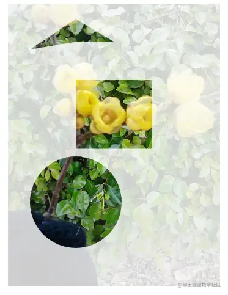
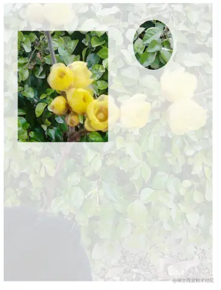
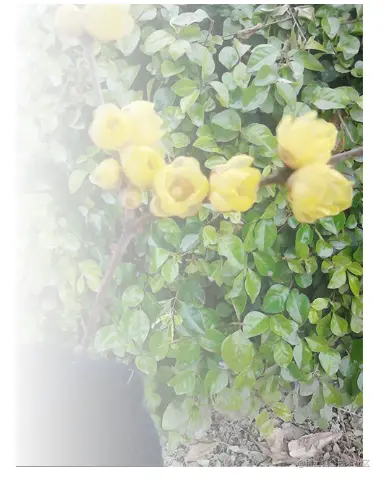

# 学习SVG（九）裁剪和蒙版

## 裁剪

- 使用`clipPath`元素创建裁剪区域。区域内的部分显示，区域外的隐藏。

```html
  <clipPath id="rectClip">
    <rect x="100" y="100" width="100" height="90" fill="none" stroke="black"></rect>
    <circle cx="100" cy="260" r="60" fill="none"></circle>
    <path d="M100 50L150,50L100,20L40,60Z" fill="none"></path>
  </clipPath>

  <image x="0" y="0" width="300" height="370" xlink:href="1.jpg" opacity="0.2"></image>
  <image x="0" y="0" width="300" height="370" xlink:href="1.jpg" style="clip-path: url(#rectClip)"></image>
```



- 创建一个裁剪区域，在区域中绘制图形。并在需要裁剪的元素上使用`clip-path`属性加载区域，就形成了裁剪效果。
- 这里为了效果更明显加载了两次图片，第一张添加透明度，第二张添加裁剪。能明显的看出第二张图片只展示了裁剪后的部分。
- 除了形状元素，文本元素也可用于裁剪。

```js
      <defs>
        <clipPath id="rectClip">
          <text
            x="20"
            y="200"
            textLength="200"
            lengthAdjust="spacing"
            font-family="Vollkorn"
            font-size="100px"
            font-weight="700"
          >
            你好
          </text>
        </clipPath>
      </defs>

      <image x="0" y="0" width="300" height="370" xlink:href="1.jpg" opacity="0.2"></image>
      <image x="0" y="0" width="300" height="370" xlink:href="1.jpg" style="clip-path: url(#rectClip)"></image>
```


### clipPathUnits 属性

- 设置裁剪区域元素的数据格式。默认`userSpaceOnUse`坐标系值。`objectBoundingBox`裁剪区域的百分比值。

```html
<defs>
<clipPath id="rectClip" clipPathUnits="objectBoundingBox">
  <rect x=".10" y=".10" width=".40" height=".40" fill="none" stroke="black"></rect>
  <circle cx=".70" cy=".15" r=".09" fill="none"></circle>
</clipPath>
</defs>

<image x="0" y="0" width="300" height="370" xlink:href="1.jpg" opacity="0.2"></image>
<image x="0" y="0" width="300" height="370" xlink:href="1.jpg" style="clip-path: url(#rectClip)"></image>
```



- 和上面一样，只是值修改为百分比设置。

## 蒙版

- 使用`mask`元素创建蒙版，通过`x,y,width,height`指定蒙版的尺寸。
- `maskUnits`属性设置蒙版元素的格式。默认值`objectBoungdingBox`，百分比格式。值`userSpaceOnUse`，坐标格式。
- `maskContenUnits`属性设置蒙版内元素的格式。默认`userSpaceOnUse`，坐标格式。值`objectBoungdingBox`，门板对象的百分比格式。
- **蒙版中\*黑色代表不可见\*（opacity: 0），\*白色代表可见\*（opacity: 100%）**。

```html
<defs>
<mask id="mask-rect" x=".2" y=".2" width=".8" height=".8">
  <rect x="50" y="50" width="100" height="100" fill="white"></rect>
  <rect width="50" height="50" fill="black" x="60" y="60"></rect>
</mask>
</defs>
<rect x="0" y="0" width="200" height="200" fill="#d4fcff"></rect>
<rect x="0" y="0" width="200" height="200" fill="#fcd3db" mask="url(#mask-rect)"></rect>
```


1. 先创建红色前景和蓝色背景。
2. 创建蒙版，为元素80%的大小。
3. 添加图形元素并指定黑白颜色。白色蒙版可见展示红色背景，黑色不可见展示底层蓝色背景。

### 图片渐变

- 创建一个黑色到白色之间的线性渐变，盖在图片上实现图片渐变效果。

```html
<defs>
<linearGradient id="whiteBlack">
  <stop offset="0" stop-color="white"></stop>
  <stop offset="100%" stop-color="black"></stop>
</linearGradient>
<mask id="mask-rect">
  <rect x="0" y="0" width="300" height="370" fill="url(#whiteBlack)"></rect>
</mask>
</defs>
<image x="0" y="0" width="300" height="370" xlink:href="1.jpg"></image>
<rect x="0" y="0" width="300" height="370" fill="white" mask="url(#mask-rect)"></rect>
```

